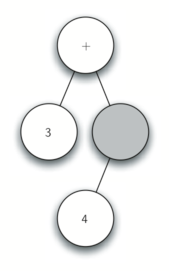

# Introdução

## Programação Orientada a Objetos em Python: Definindo Classes
O Python é uma linguagem orientada a objetos, e um de seus maiores recursos é permitir que programadores criem **novas classes** para representar dados e comportamentos específicos.   

Isso é feito por meio da implementação de **tipos de dados abstratos**, que descrevem tanto o **estado** (dados) quanto os **métodos** (ações) de um objeto.

Criar classes personalizadas permite aplicar **abstração**, facilitando a **modelagem** e **solução** de problemas em programas.

### Classe `Fraction`
A classe `Fraction` representa o comportamento de uma fração como um **valor exato**, mantendo sempre a forma mais simplificada possível.

####  Estrutura de uma Fração
- **Numerador**: qualquer número inteiro  
- **Denominador**: qualquer número inteiro **positivo** (> 0)

#### Funcionalidades da Classe
A classe `Fraction` permitirá realizar as **quatro operações básicas** entre frações:
- **Adição**
- **Subtração**
- **Multiplicação**
- **Divisão**

As frações devem ser exibidas na **forma padrão com barra**, como por exemplo: `3/5`.

Todos os resultados devem ser reduzidos aos **menores termos**, garantindo que as frações estejam sempre em sua forma mais simples.

#### Definindo a Classe em Python
Em Python, uma **classe** é definida usando a palavra-chave `class`, seguida por um **nome** e um **conjunto de métodos** (semelhantes a funções).

```python
class Fraction:
    # Os métodos serão definidos aqui
```

#### O Construtor
O primeiro método que toda classe precisa é o construtor, que define como os objetos serão criados.
- Em Python, o construtor é sempre chamado __init__
- Esse método recebe os dados necessários para inicializar o objeto

```python
class Fraction:
    def __init__(self, cima, baixo):
        self.num = cima
        self.den = baixo
```

#### Parâmetros:
- `self` : referência ao **próprio** objeto (**obrigatório** como primeiro parâmetro, mas não é passado na chamada)
- `cima` : valor do numerador
- `baixo` : valor do denominador

O uso de `self.num` e `self.den` define dois atributos internos que representam o estado da fração.

#### Criando uma Instância
Para criar uma instância da classe Fraction, basta chamar o construtor com os dois valores:

```python
myfraction = Fraction(3, 5)
```


Quando tentamos imprimir um objeto da classe Fraction com print, o Python não sabe como convertê-lo em string, então exibe apenas seu **endereço de memória**. Para resolver isso, podemos:

1. Criar um método show() que imprime os atributos da fração no formato desejado (ex: 3 / 5), mas isso não resolve o problema do print.

```python
def show(self):
     print(self.num,"/",self.den)

>>> myfraction = Fraction(3,5)
>>> myfraction.show()
3 / 5
>>> print(myfraction)
<__main__.Fraction instance at 0x40bce9ac>
>>>
```

2. A maneira correta é **sobrescrever** o método especial `__str__`, que define como o objeto será convertido em string. Ao fazer isso, o print passará a exibir o conteúdo da fração como esperado (ex: 3/5), melhorando a legibilidade.

```python
def __str__(self):
    return str(self.num)+"/"+str(self.den)

>>> myfraction = Fraction(3,5)
>>> print(myfraction)
3/5
>>> print("Eu comi", myfraction, "da pizza")
Eu comi 3/5 da pizza
>>> myfraction.__str__()
'3/5'
>>> str(myfraction)
'3/5'
>>>
```

Para permitir que objetos da classe Fraction usem operadores como `+`, é necessário **sobrescrever métodos especiais** do Python. Por padrão, f1 + f2 entre duas frações gera erro, pois o operador `+` não entende como **somar instâncias** da classe.

```python
>>> f1 = Fraction(1,4)
>>> f2 = Fraction(1,2)
>>> f1+f2

Traceback (most recent call last):
  File "<pyshell#173>", line 1, in -toplevel-
    f1+f2
TypeError: unsupported operand type(s) for +:
          'instance' and 'instance'
>>>
```

A solução é implementar o método `__add__`, que define como dois **objetos** `Fraction` devem ser **somados**. 

A implementação usa o **produto cruzado** $ \frac{a}{b} + \frac{c}{d} = \frac{ad + cb}{bd}$ para obter um denominador comum, somando os numeradores adequadamente.

**Obs** : O resultado pode não estar na **forma reduzida**

```python
def __add__(self,other):

     novonum = self.num * other.den + self.den * other.num
     novoden = self.den * other.den

     return Fraction(novonum,novoden)

>>> f1 = Fraction(1,4)
>>> f2 = Fraction(1,2)
>>> f3 = f1+f2
>>> print(f3)
6/8
>>>
```

Para resolver isso, usa-se o **algoritmo de Euclides** para calcular o **máximo divisor comum** (MDC), que é então usado para **simplificar a fração**. Assim, o resultado da soma estará sempre nos termos mais baixos.

```python
def mdc(m, n):
    while m % n != 0:
        mvelho = m
        nvelho = n

        m = nvelho
        n = mvelho % nvelho
    return n

print(mdc(20,10))
```

```python
def __add__(self, other):
    novonum = self.num * other.den + self.den * other.num
    novoden = self.den * other.den
    comum = mdc(novonum, novoden)
    return Fraction(novonum // comum, novoden // comum)

>>> f1=Fraction(1, 4)
>>> f2=Fraction(1, 2)
>>> f3=f1+f2
>>> print(f3)
3/4
>>>
```


Os dois objetos `Fraction` com os **mesmos valores** (como 1/2) **não** são considerados iguais a menos que sejam **exatamente o mesmo objeto** — isso é chamado de **igualdade rasa**. 

Para corrigir isso, implementamos o método especial `__eq__`, que permite comparar **frações diferentes** com o **mesmo valor**, o que chamamos de **igualdade profunda**.

O método `__eq__` funciona comparando os valores reais das frações, **multiplicando cruzado** os numeradores e denominadores para verificar se representam a **mesma quantidade**. 

Isso permite usar `f1 == f2` com precisão. Também é possível sobrescrever outros métodos relacionais como `__le__` para comparações como **"menor ou igual"**.

```python
def __eq__(self, other):
    primeiro = self.num * other.den
    segundo  = other.num * self.den

    return primeiro == segundo
```


#### Classe Completa
```python
def mdc(m,n):
    while m % n != 0:
        oldm = m
        oldn = n

        m = oldn
        n = oldm % oldn
    return n

class Fraction:
    def __init__(self,cima,baixo):
        # Evitar divisão por 0
        if baixo == 0:
            raise ValueError("Denominador não pode ser zero.")
        # Evitar casos como -1/-2 ou 1/-2, manter o sinal sempre no numerador
        if baixo < 0:
            cima = -cima
            baixo = -baixo
        # As frações são criadas já reduzidas
        comum = mdc(abs(cima), abs(baixo))
        self.num = cima // comum
        self.den = baixo // comum

    def __str__(self):
        return str(self.num)+"/"+str(self.den)

    def show(self):
        print(self.num,"/",self.den)

    def __add__(self, other):
        novonum = (self.num * other.den) + (self.den * other.num)
        novoden = self.den * other.den
        comum = mdc(novonum, novoden)
        return Fraction(novonum // comum, novoden // comum)

    def __eq__(self, other):
        primeiro = self.num * other.den
        segundo  = other.num * self.den

        return primeiro == segundo

    def __sub__(self, other):
        novo_num = (self.num * other.den) - (self.den * other.num)
        novo_den = self.den * other.den
        return Fraction(novo_num, novo_den)

    def __mul__(self, other):
        novo_num = (self.num *  other.num)
        novo_den = (self.den * other.den)
        return Fraction(novo_num, novo_den)

    def __truediv__(self, other):
        novo_num = (self.num *  other.den)
        novo_den = (self.den * other.num)
        return Fraction(novo_num, novo_den)

    def __gt__(self,other):
        primeiro = self.num * other.den
        segundo  = other.num * self.den
        return primeiro > segundo
    
    def __lt__(self,other):
        primeiro = self.num * other.den
        segundo  = other.num * self.den
        return primeiro < segundo
    
x = Fraction(1, 2)
y = Fraction(2, 3)

print(x + y)   # Soma
print(x - y)   # Subtração
print(x * y)   # Multiplicação
print(x / y)   # Divisão
print(x == y)  # Igualdade
print(x > y)   # Maior
print(x < y)   # Menor
```

### Herança: Circuitos e Portas Lógicas
A **herança** é um conceito fundamental da programação orientada a objetos, que permite que uma classe (**subclasse**) herde características (**dados e comportamentos**) de outra (**superclasse**), de forma semelhante à herança genética entre pais e filhos. 

No Python, por exemplo, listas, tuplas e strings são **subclasses** de *coleções sequenciais*, herdando propriedades como **ordenação** e operações comuns (como **concatenação** e **indexação**). 


Cada subclasse pode ter **características específicas** que a **diferenciam** da superclasse. Essa organização hierárquica facilita a reutilização de código e o entendimento das relações entre os tipos de dados.

#### Exemplo : Circuitos Digitais 
A construção de circuitos digitais pode ser simulada usando o conceito de **portas lógicas**, que representam **relações booleanas** entre **entradas e saídas**. 

As portas `AND` e `OR` possuem **duas entradas**: a porta `AND` só **retorna 1 se ambas as entradas forem 1**, enquanto a `OR` **retorna 1 se ao menos uma for 1**. 

A porta `NOT`, por sua vez, tem uma **única entrada** e **retorna o valor oposto**. 

Cada porta possui uma **tabela verdade** que descreve seu comportamento.  


Combinando essas portas, é possível formar circuitos mais complexos.  
**Por exemplo:**



Para simular circuitos digitais, o primeiro passo é representar **portas lógicas** como **classes** organizadas em uma *hierarquia de herança*. 


No topo está a classe `LogicGate`, que define as *características gerais comuns* a todas as portas: um **rótulo** (label) e uma **linha de saída**(outout).

Essa classe é estendida por duas **subclasses**: 
- `UnaryGate` : Portas com uma entrada.(`NOT`) 
- `BinaryGate` : Portas com duas entradas.(`AND`,`OR`,...) 

A classe base LogicGate define métodos como `getLabel()` e `getOutput()`, mas **não** implementa a lógica da porta (`performGateLogic`). 

Essa lógica será definida pelas **subclasses**. Esse uso da **herança** e do **polimorfismo** permite criar novas portas **reutilizando** e **estendendo a estrutura** existente de forma eficiente.

```python
class LogicGate:
    def __init__(self,n):
        self.label = n
        self.output = None

    def getLabel(self):
        return self.label

    def getOutput(self):
        self.output = self.performGateLogic()
        return self.output
```

As portas lógicas são **categorizadas** de acordo com o **número de entradas**, chamadas de *“pinos”*.

A classe `BinaryGate` adiciona os pinos **pinA** e **pinB** e **métodos para capturar seus valores** via entrada do usuário.Enquanto,a clase `UnaryGate` adiciona um **único pino** e seu respectivo método. 

Cada classe chama **explicitamente** o **construtor da classe pai** para garantir que o rótulo (label) seja **inicializado** corretamente. 

Esse padrão de construção é essencial em hierarquias de classes orientadas a objetos e **garante** que **atributos herdados** sejam devidamente **configurados**.

```python
class BinaryGate(LogicGate):
    def __init__(self,n):
        LogicGate.__init__(self,n)
        self.pinA = None
        self.pinB = None

    def getPinA(self):
        return int(input("Digite a entrada do Pino A para a porta "+ self.getLabel()+"-->"))

    def getPinB(self):
        return int(input("Digite a entrada do Pino B para a porta "+ self.getLabel()+"-->"))
```

```python
class UnaryGate(LogicGate):
    def __init__(self,n):
        LogicGate.__init__(self,n)
        self.pin = None

    def getPin(self):
        return int(input("Digite a entrada do Pino para a porta "+ self.getLabel()+"-->"))
```

Com a hierarquia básica pronta, é possível definir **classes específicas** para **portas lógicas** como `AndGate`, `OrGate` e `NotGate`. 

A classe `AndGate` **herda** de `BinaryGate` e **implementa** o método `performGateLogic`, responsável por aplicar a operação lógica `AND`: **retorna 1 apenas se ambas as entradas forem 1**. 

```python
class AndGate(BinaryGate):
    def __init__(self,n):
        BinaryGate.__init__(self,n)

    def performGateLogic(self):
        a = self.getPinA()
        b = self.getPinB()
        if a == 1 and b == 1:
            return 1
        else:
            return 0
```

De forma semelhante, `OrGate` e `NotGate` **herdam** de `BinaryGate` e `UnaryGate`, respectivamente, e **implementam suas próprias versões** de `performGateLogic` para executar as operações `OR` e `NOT`. 

```python
class OrGate(BinaryGate):
    def __init__(self,n):
        BinaryGate.__init__(self,n)

    def performGateLogic(self):
        a = self.getPinA()
        b = self.getPinB()
        if a == 1 or b == 1:
            return 1
        else:
            return 0
```

```python
class NotGate(UnaryGate):
    def __init__(self,n):
        UnaryGate.__init__(self,n)

    def performGateLogic(self):
        if self.getPin():
            return 0
        else:
            return 1
```

Essas classes **não** precisam definir novos atributos, pois **herdam** os **pinos** e o **rótulo** das classes-pai. 

Ao criar uma instância dessas portas e chamar o método `getOutput`, os **valores das entradas** são solicitados ao usuário e o resultado lógico é retornado.

```python
>>> g1 = AndGate("G1")
>>> g1.getOutput()
Digite a entrada do Pino A para a porta G1-->1
Digite a entrada do Pino B para a porta G1-->0
0
```

```python
>>> g2 = OrGate("G2")
>>> g2.getOutput()
Digite a entrada do Pino A para a porta G2-->1
Digite a entrada do Pino B para a porta G2-->1
1
>>> g2.getOutput()
Digite a entrada do Pino A para a porta G2-->0
Digite a entrada do Pino B para a porta G2-->0
0
>>> g3 = NotGate("G3")
>>> g3.getOutput()
Digite a entrada do Pino para a porta G3-->0
1
```

Com as portas lógicas básicas prontas, passamos à **construção de circuitos** conectando saídas de uma porta às entradas de outra. 

Para isso, introduzimos a classe `Connector`,que **não** faz parte da hierarquia de portas, mas possui (TEM-UM) instâncias de portas. 


Essa distinção é importante: ao contrário do relacionamento “É-UM” que **exige herança**, o relacionamento “TEM-UM” significa **apenas que um objeto contém outro**. 

A classe `Connector` conecta **duas portas** — fromgate (**porta de saída**) e togate (**porta de entrada**) —, criando o **fluxo de dados** entre elas. 

```python
class Connector:
    def __init__(self, fgate, tgate):
        self.fromgate = fgate
        self.togate = tgate
        tgate.setNextPin(self)

    def getFrom(self):
        return self.fromgate

    def getTo(self):
        return self.togate
```

Ao ser instanciado, o conector chama `setNextPin` na **porta de destino** para escolher automaticamente o **próximo pino disponível**, possibilitando a composição de circuitos mais complexos.

Para permitir **conexões entre portas**, a classe `BinaryGate` inclui o **método** `setNextPin`, que conecta um conector à primeira entrada disponível: se pinA estiver livre, ele é usado; caso contrário, tenta-se pinB; se ambos estiverem ocupados, um erro é gerado. 

```python
def setNextPin(self,source):
    if self.pinA == None:
        self.pinA = source
    else:
        if self.pinB == None:
            self.pinB = source
        else:
           raise RuntimeError("Erro: NÃO HÁ PINO LIVRE")
```

A entrada de dados pode agora vir de duas formas: ou via **entrada externa** (usuário), ou via **saída de outra porta** conectada. 

Para lidar com isso, os métodos `getPinA` e `getPinB` foram modificados para **verificar** se a entrada está conectada — se estiver, a entrada é buscada **recursivamente** a partir da saída da porta conectada. 

```python
def getPinA(self):
    if self.pinA == None:
        return input("Digite a entrada do Pino A para a porta " + self.getName()+"-->")
    else:
        return self.pinA.getFrom().getOutput()
```

Com isso, ao pedir a saída de uma porta no final do circuito, toda a lógica é processada de trás para frente, até as entradas finais, produzindo a saída geral do circuito.

Exemplo:
```python
>>> g1 = AndGate("G1")
>>> g2 = AndGate("G2")
>>> g3 = OrGate("G3")
>>> g4 = NotGate("G4")
>>> c1 = Connector(g1,g3)
>>> c2 = Connector(g2,g3)
>>> c3 = Connector(g3,g4)
```

As saídas das duas portas `AND` (`g1` e `g2`) são conectadas à porta `OR` (`g3`) e essa saída está conectada à porta NOT (`g4`).A saída da porta `NOT` é a saída de todo o o circuito

```python
>>> g4.getOutput()
Digite a entrada do Pino A para a porta G1-->0
Digite a entrada do Pino B para a porta G1-->1
Digite a entrada do Pino A para a porta G2-->1
Digite a entrada do Pino B para a porta G2-->1
0
```

##### Classes `NorGate` e `NandGate`


##### Classe Completa
```python
class LogicGate:
    def __init__(self,n):
        self.name = n
        self.output = None

    def getName(self):
        return self.name

    def getOutput(self):
        self.output = self.performGateLogic()
        return self.output

class BinaryGate(LogicGate):
    def __init__(self,n):
        LogicGate.__init__(self,n)
        self.pinA = None
        self.pinB = None

    def getPinA(self):
        if self.pinA == None:
            return int(input("Digite a entrada do Pino A para a porta "+self.getName()+"-->"))
        else:
            return self.pinA.getFrom().getOutput()

    def getPinB(self):
        if self.pinB == None:
            return int(input("Digite a entrada do Pino B para a porta "+self.getName()+"-->"))
        else:
            return self.pinB.getFrom().getOutput()

    def setNextPin(self,source):
        if self.pinA == None:
            self.pinA = source
        else:
            if self.pinB == None:
                self.pinB = source
            else:
                print("Erro: NÃO HÁ PINO LIVRE")


class AndGate(BinaryGate):
    def __init__(self,n):
        BinaryGate.__init__(self,n)

    def performGateLogic(self):
        a = self.getPinA()
        b = self.getPinB()
        if a == 1 and b == 1:
            return 1
        else:
            return 0

class OrGate(BinaryGate):
    def __init__(self,n):
        BinaryGate.__init__(self,n)

    def performGateLogic(self):

        a = self.getPinA()
        b = self.getPinB()
        if a == 1 or b == 1:
            return 1
        else:
            return 0

class NorGate(BinaryGate):
    def __init__(self,n):
        BinaryGate.__init__(self,n)

    def performGateLogic(self):
        a = self.getPinA()
        b = self.getPinB()
        if a == 1 or b == 1:
            return 0
        else:
            return 1

class NandGate(BinaryGate):
    def __init__(self,n):
        BinaryGate.__init__(self,n)

    def performGateLogic(self):
        a = self.getPinA()
        b = self.getPinB()
        if a == 1 and b == 1:
            return 0
        else:
            return 1

class UnaryGate(LogicGate):
    def __init__(self,n):
        LogicGate.__init__(self,n)
        self.pin = None

    def getPin(self):
        if self.pin == None:
            return int(input("Digite a entrada do Pino para a porta "+self.getName()+"-->"))
        else:
            return self.pin.getFrom().getOutput()

    def setNextPin(self,source):
        if self.pin == None:
            self.pin = source
        else:
            print("Erro: NÃO HÁ PINO LIVRE")

class NotGate(UnaryGate):
    def __init__(self,n):
        UnaryGate.__init__(self,n)

    def performGateLogic(self):
        if self.getPin():
            return 0
        else:
            return 1

class Connector:
    def __init__(self, fgate, tgate):
        self.fromgate = fgate
        self.togate = tgate
        tgate.setNextPin(self)

    def getFrom(self):
        return self.fromgate

    def getTo(self):
        return self.togate

def main():
   g1 = AndGate("G1")
   g2 = AndGate("G2")
   g3 = OrGate("G3")
   g4 = NotGate("G4")
   c1 = Connector(g1,g3)
   c2 = Connector(g2,g3)
   c3 = Connector(g3,g4)
   print(g4.getOutput())

main()
```
