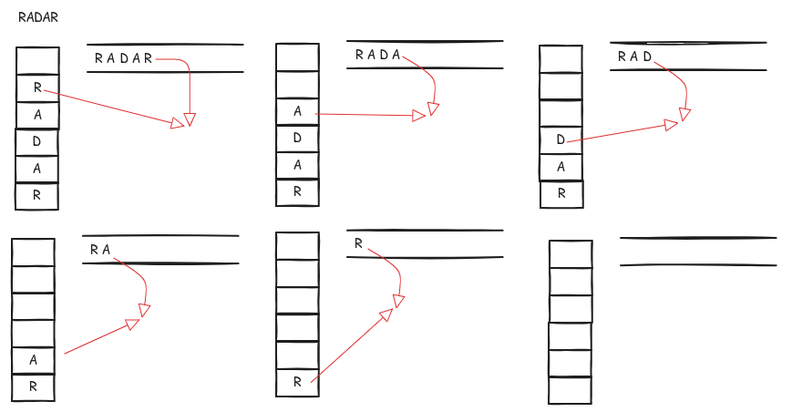
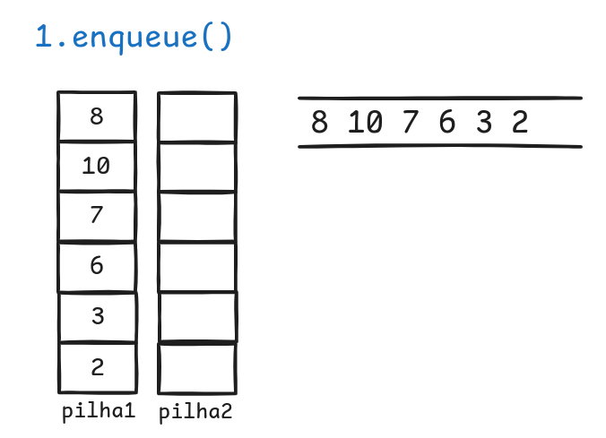
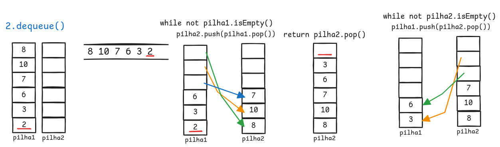
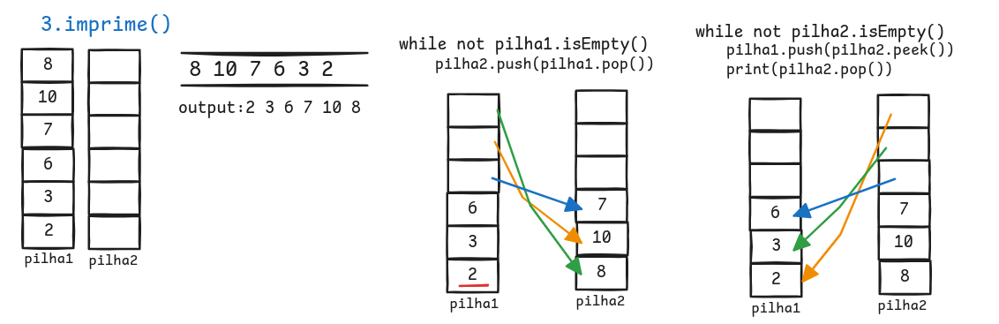

# Filas
- Uma **fila** (_queue_) é uma **coleção ordenada** de itens em que a **inserção** de novos itens acontece em uma **extremidade**,“fim”(_rear_), e a **remoção** de itens existente ocorre no **outro extremo**,“início”(_front_)
- Um elemento é **inserido no fim da fila** e faz o seu **caminho em direção ao início**,esperando até aquele momento em que é o próximo elemento a ser removido
- O item **inserido** mais recentemente na fila deve aguardar no **final da coleção**, enquanto o item que está na coleção há mais tempo está mais **próximo do início**
- Segue o princípio de ordenação **FIFO** (*first in first out*).

*Exemplo*:
> [!note] 
>- Fila de cinema,Fila de supermercado,Fila de restaurante
>- **Impressora**: Quando várias pessoas enviam documentos para impressão, eles entram em uma _fila_. A impressora segue a ordem de chegada: quem mandou primeiro imprime primeiro. Quem mandou por último precisa esperar sua vez.
>- **Sistema Operacional**: O computador usa _filas_ para organizar o que cada programa ou processo vai fazer. Ele decide qual tarefa executar primeiro com base em regras (algoritmos de escalonamento). Até mesmo quando digitamos e o texto demora a aparecer, isso acontece porque os caracteres estão esperando em uma _fila_ (buffer) até o computador estar pronto para mostrá-los na tela.
- São muito **restritivas** já que só existe **uma maneira de entrar** e apenas **uma maneira de sair**.
- **Não** é permitido **furar a fila** e sair antes de você ter esperado o tempo necessário para chegar ao início.
 

## Tipo Abstrato de Dado
- `Queue()`: **Cria** uma nova fila vazia
	- Sem parâmetros
	- Retorna uma fila vazia
- `enqueue(item)`: **Insere** um novo item na fila (*Enfileirar*)
	- Necessita do item a ser inserido
	- Sem retorno
- `dequeue()`: **Remove** o item que está no **inicia** da fila (*Desfileirar*)
	- Sem parâmetro
	- Retorna o item removido
	- A fila é **modificada**
- `isEmpty()`: **Testa** se a fila está **vazia**
	- Sem Parâmetros
	- Retorna um booleano: `True or False`
- `size()`: **Retorna** o **número de itens** na fila
	- Sem parâmetros 
	- Retorna um `int`

| Operação         | Conteúdo da fila      | Valor retornado |
| ---------------- | --------------------- | --------------- |
| q.isEmpty()      | []                    | True            |
| q.enqueue(4)     | [4]                   |                 |
| q.enqueue('dog') | ['dog', 4]            |                 |
| q.enqueue(True)  | [True, 'dog', 4]      |                 |
| q.size()         | [True, 'dog', 4]      | 3               |
| q.isEmpty()      | [True, 'dog', 4]      | False           |
| q.enqueue(8.4)   | [8.4, True, 'dog', 4] |                 |
| q.dequeue()      | [8.4, True, 'dog']    | 4               |
| q.dequeue()      | [8.4, True]           | dog             |
| q.size()         | [8.4, True]           | 2               |
## Implementação de uma Fila
- A implementação de um tipo abstrato de dados como uma **fila** é feita através da criação de uma nova **classe**
- Consequentemente, as **operações** sobre uma fila são implementadas como **métodos**
- Além disso, para implementar uma fila, que é uma coleção de elementos, usaremos uma lista (`list`) e seus métodos.
 - Contudo,é preciso decidir qual **extremidade da lista** usar como parte de **fim** e qual usa como **início**.
 - Nessa implementação supõe que o **fim** está na **posição 0 da lista**.
	 - `insert()` --> **Adicionar** novos elementos ao **final da fila**.
	 - `pop()` --> **Remover** o elemento do **início** (o **último elemento** da lista).
	- Logo, `enqueue()` = $O(n)$ e `dequeue()` = $O(1)$.

```python
class Queue:
	# Construtor
	def __init__(self):
		self.items = []
	# Métodos
	def isEmpty(self):
		return self.items == []
	def enqueue(self, item):
		self.items.insert(0,item)
	def dequeue(self):
		return self.items.pop()
	def size(self):
		return len(self.items)
```

### Exemplos:
#### Batata Quente
- **Problema:**  Dado uma lista de nomes e um número `num`, simula-se uma brincadeira onde as pessoas passam a "batata quente" em círculo. A cada ciclo de `num` passadas, uma pessoa é eliminada. O processo continua até restar apenas um nome.
- **Ideia de solução:**
	1. Adicionar os nomes em uma fila
	2. **Enquanto** tiver mais de um nome na fila
		1. Remove o primeiro nome e colocá-lo no **final da fila** durante `num` **repetições**
		2. Após `num` repetições, remover a pessoa que está na **frente da fila** permanentemente.
		3. Continuar até sobrar apenas um nome.
	3. Ao final **retorna** o nome da pessoa que **restou na fila** que é a **ganhadora**


```python
# Exemplo 1: Batata Quente
def hotPotato(nameList, num):
	q = Queue()
	# Adiciona todos os nomes à fila
	for name in nameList:
		q.enqueue(name)
	# Continua enquanto houver mais de uma pessoa na fila == Enquanto tiver brincadeira
	while q.size() > 1:
	# Passa a batata num vezes: move o primeiro para o final da fila
		for i in range(num):
			q.enqueue(q.dequeue())
		# Remove a pessoa que ficou com a batata
		q.dequeue()
	# Retorna o nome da pessoa vencedora
	return q.dequeue()
print(hotPotato(["Bill", "David", "Susan", "Jane", "Kent", "Brad"], 7))
```
#### Palíndromo
- É uma palavra, frase ou número que **se lê da mesma forma** da esquerda para a direita ou da direita para a esquerda
- "ovo", "radar", "osso", "Ana".
- **Problema:** Determinar de duas palavras são palíndromos usando pilha e fila 
- **Ideia de solução:**
	- **Inicialização**: são criadas uma pilha (`Stack`) e uma fila (`Queue`).
	- **Preparação dos dados**: todos os caracteres da frase, exceto os espaços, são adicionados simultaneamente à pilha e à fila.
	    - A pilha armazena os caracteres de modo que o último inserido será o primeiro a ser removido (ordem inversa).
	    - A fila armazena os caracteres de modo que o primeiro inserido será o primeiro a ser removido (ordem normal).
	- **Comparação**:
	    - Enquanto a pilha não estiver vazia, são removidos um elemento da pilha e um da fila.
	    - Se em algum momento os caracteres removidos forem diferentes, a frase não é um palíndromo e a função retorna `False`.  
	- **Resultado**:
	    - Se todos os pares comparados forem iguais, a função retorna `True`, indicando que a frase é um palíndromo.



```python
def ehPalindromo(frase):
	s = Stack()
	q = Queue()
	#Adicionar os caracteres da frase na fila e na pilha
	for caracter in frase.replace(" ",""):
		s.push(caracter)
		q.enqueue(caracter)
	#Comparar as frases
	while not s.isEmpty():
		if s.pop() != q.dequeue():
			return False
	return True
```

#### Implementação de uma Fila usando Pilhas
- Problema: Dado um código parcial de uma fila, implemente os métodos a seguir. Você têm à disposição para implementar a fila **APENAS** duas pilhas.
	- **enqueue**_(self, item)_: adiciona o _item_ no final da _fila_.
	- **dequeue**_(self)_: Retorna o _item_ do início da _fila_. Caso a fila esteja vazia, deve retornar _None_.
	- **imprime**_(self)_: Imprime todos os itens da _**fila**_ em ordem (do início para o fim).
- Idea de Solução:
	- enqueue: Apenas adicionar os item na fila1
	- dequeue: 1.transferir os itens da fila1 para uma fila2 → coloca na ordem da fila, 2.Pegar o último item da fila = item no topo da pilha2, 3.retorna os itens para a pilha1
	- imprime: 1.transferir os itens da fila1 para uma fila2 → coloca na ordem da fila, 2.pegar o topo da pilha2 e adicioná-lo na pilha1,3.imprimir o topo do fila2 já tirando-o da fila2




#### Tarefas de Impressão
Considere o seguinte cenário: em um laboratório de Ciência da Computação, em média, cerca de 10 estudantes estão presentes em uma determinada hora do dia. Cada estudante costuma enviar até **duas tarefas de impressão** durante esse período, e o tamanho das tarefas varia entre **1 e 20 páginas**.

A impressora do laboratório é antiga e pode imprimir:
- **10 páginas por minuto** em qualidade de rascunho, ou
- **5 páginas por minuto** se configurada para alta qualidade.

Optar pela alta qualidade pode tornar a impressão muito lenta, aumentando o tempo de espera dos estudantes. Assim, surge a questão: **qual configuração de impressão devemos usar para minimizar o tempo de espera?**

Para analisar isso, propomos construir uma **simulação** que modele o funcionamento do laboratório.
##### Componentes da Simulação
Precisaremos representar:
- **Estudantes**, que geram tarefas de impressão;
- **Tarefas de impressão**, que possuem um tamanho aleatório de 1 a 20 páginas;
- **A impressora**, que processa as tarefas conforme sua velocidade.

À medida que as tarefas são geradas, elas são adicionadas a uma **fila de espera**. Quando a impressora termina a tarefa atual, ela verifica se há outras tarefas na fila e inicia a próxima.

Nosso principal interesse é determinar a **média do tempo de espera** dos estudantes, ou seja, o tempo médio que uma tarefa permanece na fila antes de ser impressa.


##### Como Modelar a Geração de Tarefas
Precisamos introduzir aleatoriedade:
- O tamanho da tarefa é um número aleatório entre **1 e 20 páginas**, com todos os valores igualmente prováveis.
Sabendo que:
- Temos **10 estudantes**, e
- Cada um imprime, em média, **2 vezes por hora**,
Teremos aproximadamente **20 tarefas por hora**.

Agora, para calcular a chance de surgimento de uma nova tarefa a cada segundo:
- 1 hora = 60 minutos = 3600 segundos,
- Assim, **20 tarefas por 3600 segundos** equivalem a **1 tarefa a cada 180 segundos**, em média.
**Fórmula:**
$$ 
20 \text{ tarefas} \times \frac{1 \text{ hora}}{60 \text{ minutos}} \times
\frac{1 \text{ minuto}}{60 \text{ segundos}} = \frac{1 \text{ tarefa}}{180 \text{ segundos}} 
$$

Para simular isso:
- A cada segundo, geramos um número aleatório entre 1 e 180.
- Se o número for **180**, criamos uma nova tarefa de impressão.
**Observação:** Como é uma simulação, podem ocorrer vários envios de tarefas em sequência ou grandes intervalos sem novos envios. A aleatoriedade reflete o comportamento realista baseado nos parâmetros que conhecemos.

##### Passos da Simulação
1. Crie uma fila de tarefas de impressão.Cada tarefa está associada ao instante que chegou no fila(_timestamp_).Inicialmente a fila está vazia.
2. Para cada segundo (`currentSecond`):
	- Uma nova tarefa de impressão é criada? Em caso afirmativo, adicione-a à fila com o `currentSecond` como o instante associado.
	- Se a impressora não estiver ocupada e se uma tarefa estiver aguardando,
		- Remova a próxima tarefa da fila de impressão e atribua-a a impressora.
		- Subtrai o instante associado a tarefa do `currentSecond` para computar o tempo de espera para essa tarefa. 
		- Anexe o tempo de espera dessa tarefa a uma lista para mais tarde ser processada.
		- Com base no número de páginas da tarefa de impressão, calcule o tempo será necessário para imprimi-la.
	- A impressora agora faz um segundo de impressão, se necessário. Também é subtraído um segundo do tempo necessário para essa tarefa.
    - Se a tarefa foi concluída, em outras palavras, o tempo necessário chegou a zero, a impressora passa a estar desocupada.
3. Após a conclusão da simulação, calcule o tempo médio de espera da lista de tempos de espera gerados.
### Implementação 
Para simular o funcionamento de uma impressora em um laboratório de ciência da computação, criamos três classes principais
- **Printer (Impressora)**
- **Task (Tarefa de Impressão)**
- **PrintQueue (Fila de Impressão)**
#### Classe `Printer`
A classe `Printer` representa a impressora. Ela deve ser capaz de:
- Verificar se está ocupada imprimindo (`busy`).
- Começar a próxima tarefa (`startNext`), calculando o tempo necessário baseado no número de páginas e na velocidade de impressão.
- Reduzir o tempo restante a cada segundo (`tick`), liberando-se quando a tarefa é concluída.
#### Classe `Task`
A classe `Task` representa uma tarefa de impressão. Cada tarefa:
- Recebe um timestamp (momento de criação).
- Gera aleatoriamente um número de páginas entre 1 e 20.
- Permite calcular o tempo de espera na fila (`waitTime`).
### Função de Simulação
A função `simulation` executa o ciclo principal:
- A cada segundo:
    - Decide aleatoriamente se uma nova tarefa é criada (`newPrintTask`).
    - Enfileira novas tarefas no `printQueue`.
    - Se a impressora está livre e há tarefas na fila, pega a próxima tarefa e inicia a impressão.
    - Atualiza o status da impressora (`tick`).
- Ao final, calcula o tempo médio de espera das tarefas.

```python
from pythonds.basic.queue import Queue

import random

class Printer:
    def __init__(self, ppm):
        self.pagerate = ppm
        self.currentTask = None
        self.timeRemaining = 0

    def tick(self):
        if self.currentTask != None:
            self.timeRemaining = self.timeRemaining - 1
            if self.timeRemaining <= 0:
                self.currentTask = None

    def busy(self):
        if self.currentTask != None:
            return True
        else:
            return False

    def startNext(self,newtask):
        self.currentTask = newtask
        self.timeRemaining = newtask.getPages() * 60/self.pagerate

class Task:
    def __init__(self,time):
        self.timestamp = time
        self.pages = random.randrange(1,21)

    def getStamp(self):
        return self.timestamp

    def getPages(self):
        return self.pages

    def waitTime(self, currenttime):
        return currenttime - self.timestamp


def simulation(numSeconds, pagesPerMinute):

    labprinter = Printer(pagesPerMinute)
    printQueue = Queue()
    waitingtimes = []

    for currentSecond in range(numSeconds):

      if newPrintTask():
         task = Task(currentSecond)
         printQueue.enqueue(task)

      if (not labprinter.busy()) and (not printQueue.isEmpty()):
        nexttask = printQueue.dequeue()
        waitingtimes.append( nexttask.waitTime(currentSecond))
        labprinter.startNext(nexttask)

      labprinter.tick()

    averageWait=sum(waitingtimes)/len(waitingtimes)
    print("Average Wait %6.2f secs %3d tasks remaining."%(averageWait,printQueue.size()))

def newPrintTask():
    num = random.randrange(1,181)
    if num == 180:
        return True
    else:
        return False

for i in range(10):
    simulation(3600,5) # Average Wait 376.05 secs 1 tasks remaining.

for i in range(10):
      simulation(3600,10) # Average Wait 18.17 secs 0 tasks remaining.
```

**Conclusão**
- A velocidade da impressora afeta diretamente o tempo médio de espera e o acúmulo de tarefas na fila.
- Filas são ideais para modelar cenários onde os itens precisam ser processados em ordem de chegada (FIFO - First In, First Out).