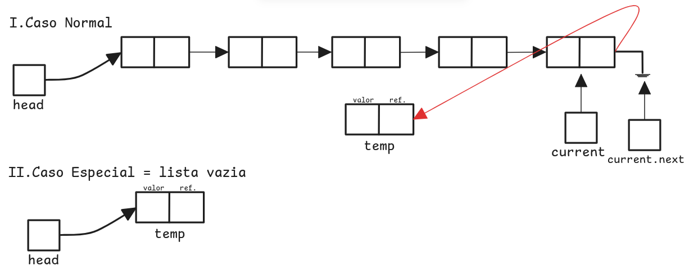
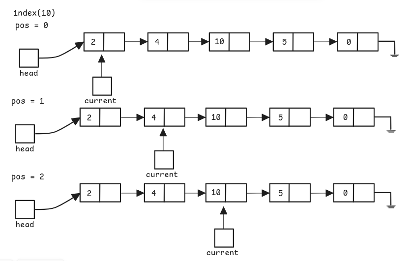
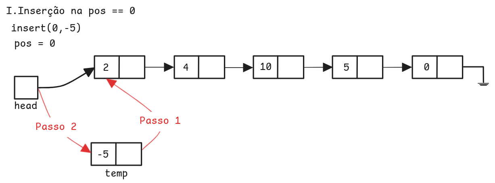
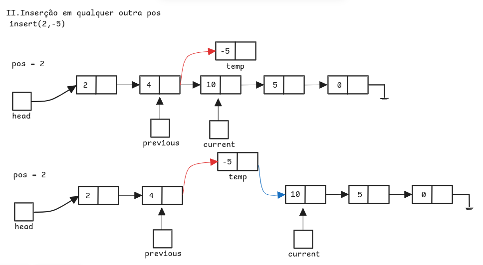
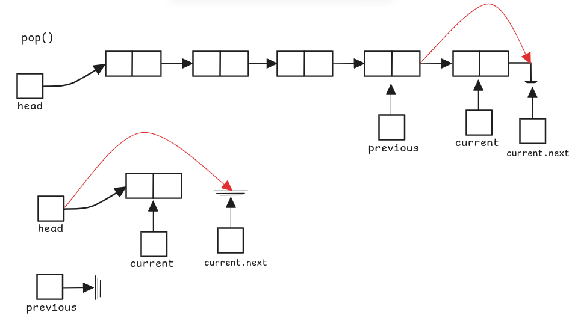
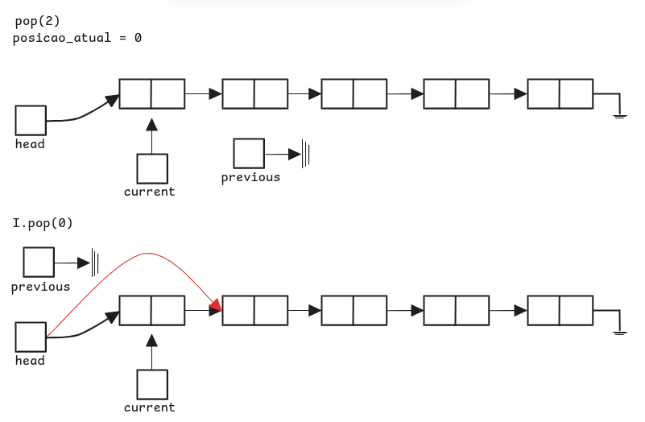
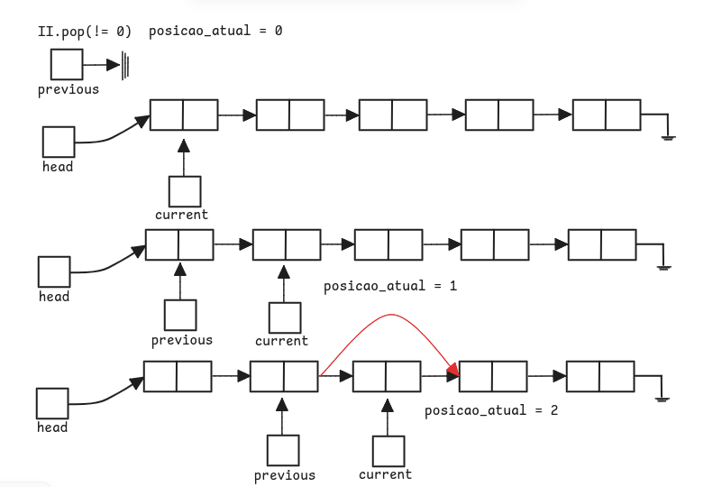

# Listas
- Uma **lista** é uma coleção de itens em que cada item tem uma posição relativa em relação aos outros. → **Lista Desordenada**. 
- **Listas** podem possuir um primeiro item, um segundo item, um terceiro item e assim por diante. 
- Além disso, é possível se referir ao **início da lista** (o **primeiro** item) ou ao **final da lista** (o **último** item).
- Exemplo: A coleção dos inteiros 54, 26, 93, 17, 77 e 31 
- **Python**: `[52, 26, 93, 17, 77, 31]` 
## Tipo Abstrato de Dado
- Operações possíveis em uma lista desordenada
- `List()`: **Cria** uma nova lista vazia.  
	- Sem parâmetros 
	- Retorna uma lista vazia.
- `add(item)`: **Insere** um novo item na lista.  
	- Parâmetro = item a ser inserido.  
	- Sem retorno  
	- Supõe que o item ainda **não está na lista**.
- `remove(item)`: **Remove** um item da lista.  
	  - Parâmetro = item a ser removido.  
	  - A lista é **modificada**.  
	  - Supõe que o item está presente na lista.
- `search(item)`: **Procura** um item na lista.  
	  - Parâmetro = item a ser procurado.  
	 - Retorna um booleano: `True or False`
- `isEmpty()`: verifica se a lista está vazia.  
	- Sem Parâmetros
	- Retorna um booleano: `True or False`
- `size()`: **Retorna** o número de itens na lista.  
	- Sem parâmetros 
	- Retorna um `int`
- `append(item)`: **Adiciona** um novo item ao **final** da lista.  
	- Parâmetro = item a ser adicionado.
	- Sem retorno  
	- Supõe que o item ainda **não está na lista**.
- `index(item)`: **Retorna** a **posição** (índice) do item na lista.  
	- Parâmetro = item ao qual deseja-se saber sua posição/índice.
	- Retorna o índice.  
	- Supõe que o item está presente na lista.
- `insert(pos, item)`: **Adiciona** um novo item na **posição** `pos` da lista.  
	- Parâmetro = item a ser inserido e a posição da qual deseja-se inseri-lo
	- Sem retorno  
	- Supõe que o **item ainda não está na lista** e que a posição `pos` é **válida**.
- `pop()`: **Remove** e **retorna** o **último item** da lista.  
	- Sem parâmetros.  
	- Retorna o item removido.  
	- Supõe que a lista tem **pelo menos um** item.
- `pop(pos)`: **Remove** e **retorna** o item na **posição** `pos`.  
	- Parâmetro = posição `pos` da qual deseja-se remover o item.  
	- Retorna o item removido.  
	- Supõe que o item está presente na lista.
## Implementação de uma Lista Ligada Desordenada
Para implementar uma lista desordenada, usamos uma **lista ligada**. 
- **Objetivo:** manter o **posicionamento relativo** dos itens (não necessariamente na memória).
- Se cada item armazenar a **localização do próximo item**, conseguimos manter a ordem relativa.

Exemplos:

 
 
 

### Conceitos importantes:
- A **posição do primeiro item** deve ser explicitamente conhecida.
- O primeiro item aponta para o segundo, o segundo para o terceiro, e assim por diante.
- A **referência externa** para o primeiro item é chamada de **cabeça** (_head_) da lista.
- O **último item** indica que **não há próximo** elemento (geralmente apontando para `null` ou equivalente).

### Classe `Node`
- O bloco básico da lista ligada é o **nó** (`Node`).
#### Cada nó contém:
- Um **campo de dados** (_data field_): armazena o item da lista.
- Uma **referência para o próximo nó**.
```python
class Node:
    def __init__(self, initdata):
        self.data = initdata
        self.next = None
        
    def getData(self):
        return self.data
    
    def getNext(self):
        return self.next

    def setData(self, newdata):
        self.data = newdata

    def setNext(self, newnext):
        self.next = newnext
```

- *Exemplo:* Criando um objeto `Node`
```python
>>> temp = Node(93)
>>> temp.getData()
93
```

- O valor especial `None` representa **ausência de próximo nó**.
- No construtor, `next` é inicialmente configurado para `None` (chamado de **"aterramento do nó"**).

   
 


>[!NOTE] 
>Sempre atribua explicitamente `None` para as referências iniciais ao criar nós.

### Classe `UnordenedList`
A **lista desordenada** é construída como uma **coleção de nós** ligados por **referências explícitas**.
- Mantém **uma única referência** ao **primeiro nó**, chamada de **cabeça** (_head_).
```python
class UnorderedList:
    def __init__(self):
        self.head = None
```

- Criação de uma lista
```python
>>> mylist = UnorderedList()
```
- Inicialmente, a lista está **vazia** e `self.head` aponta para `None`.


>[!NOTE] 
>A **lista em si não contém objetos `Node`**, apenas uma **referência para o primeiro nó**

#### Métodos

##### 1.`isEmpty()`

```python
def isEmpty(self):
    return self.head == None
```
- Retorna `True` se a **cabeça da lista for `None`**.
- Útil para saber se há nós na estrutura.
- Uso de `None` facilita identificar o **início e o fim da lista**.
##### 2.`add()`
Para **inserir um novo item** em uma lista desordenada, a localização específica não importa. Assim, optamos pela **inserção no início da lista** (cabeça), que é a mais eficiente.
- A lista só mantém uma **referência para a cabeça**.
- Inserir no início evita a necessidade de percorrer a lista.
- É suficiente modificar os ponteiros da cabeça.
*Exemplo de Inserções:*
```python
>>> mylist.add(31)
>>> mylist.add(77)
>>> mylist.add(17)
>>> mylist.add(93)
>>> mylist.add(26)
>>> mylist.add(54)
```
- O primeiro item adicionado (`31`) acaba como o **último nó**.
- O último item adicionado (`54`) se torna o **primeiro nó**.

```python
def add(self, item):
    temp = Node(item)          # Cria novo nó com os dados
    temp.setNext(self.head)    # Passo 1: aponta para o antigo primeiro nó
    self.head = temp           # Passo 2: atualiza a cabeça da lista
```

   

**Cuidado com a Ordem dos Passos:**
- Inverter as linhas 3 e 4 **faz perder os nós anteriores**.
- A cabeça era a **única referência externa** — perdê-la significa perder o restante da lista.
 

> [!NOTE]
> **Varredura de Lista Ligada**
> - A **varredura** refere-se ao processo de **percorrer cada nó** da lista a partir da cabeça. Para isso, utilizamos uma **referência auxiliar** que é atualizada com `getNext()`.

##### 3.`size()`
Retorna o número de elementos da lista(quantidade de **nós**)
```python
def size(self):
    current = self.head
    count = 0
    while current != None:
        count = count + 1
        current = current.getNext()
    return count
```
- `current`: começa na cabeça da lista.
- Enquanto `current` não for `None`, incrementa o contador.
- Retorna o número total de nós.


##### 4.`search()`
Procura um item na lista.Utiliza varredura, mas **pode parar antes do fim** se encontrar o item
```python
def search(self, item):
    current = self.head
    found = False
    while current != None and not found:
        if current.getData() == item:
            found = True
        else:
            current = current.getNext()
    return found
```
- `found` guarda se o item foi encontrado.
- O laço para se `found` for `True` ou se a lista acabar.
- Retorna `True` se encontrar o item, senão `False`.
*Exemplo*
```python
>>> mylist.search(17)
True
```
- A busca por `17` percorre a lista até achá-lo e para.


##### 5.`remove()`
Remover um **nó** que contém um **item específico** de uma lista ligada. Assume-se que o item está presente na lista.
1. **Busca pelo item**
	- Começamos com um ponteiro `current` apontando para a **cabeça da lista**. 
	- Utilizamos um segundo ponteiro `previous` para acompanhar o **nó anterior ao current**.
	- Enquanto o item **não for encontrado**, fazemos:

```python
previous = current
current = current.getNext()
```


> [!NOTE] 
> Isso garante que, ao encontrar o item, `current` aponta para o nó com o valor desejado, e `previous` aponta para o nó anterior a ele (caso exista).

2. **Remoção do nó**
	- **Item está no primeiro nó**
		- `previous` ainda é `None`
		- Atualizamos a cabeça da lista:
	- **Item está no meio ou fim da lista**
		- `previous` aponta para o nó anterior.
		- Ligamos `previous` diretamente ao nó seguinte de `current`, “pulando” `current`:

```python
self.head = current.getNext()
```

```python
previous.setNext(current.getNext())
```


```python
def remove(self,item):
    current = self.head
    previous = None
    found = False
    
    while not found:
        if current.getData() == item:
            found = True
        else:
            previous = current
            current = current.getNext()

    if previous == None:
        self.head = current.getNext()
    else:
        previous.setNext(current.getNext())
```

> [!NOTE]
> ### Observações:
> - A ordem de movimentação entre `previous` e `current` é crucial (“andar de lesma” ou _inch-worming_).
> - O método lida corretamente com:
> 	- remoção no início da lista,
> 	- remoção no meio,
> 	- remoção no fim (último nó).

##### 6.`append()`
Adiciona um item (um **nó**) ao final da lista.  
Esse método percorre a lista até encontrar o último nó (cujo `next` é `None`) e, então, adiciona o novo nó após ele.

**Dois Casos:**
1. **Lista não vazia**
    - Atravessa a lista desde o primeiro nó (`head`) até o último (onde `getNext()` é `None`).
    - Quando encontra o último nó, conecta o novo nó a ele usando `setNext()`.
2. **Lista vazia**
    - A lista não tem nenhum nó (`head` é `None`).
    - O novo nó se torna o primeiro elemento da lista (ou seja, `head` passa a apontar para ele).



```python
def append(self,item):
	temp = Node(item)
	# Caso especial: lista vazia
	if self.head is None:
		self.head = temp
	else:
		current = self.head
		while current.getNext() is not None:
			current = current.getNext()
	current.setNext(temp)
```

##### 7. `index()`
Retorna a **posição** (índice) do **primeiro nó** na lista que contém o item especificado.  
Caso o item **não esteja** na lista, retorna uma mensagem informando isso.

**Dois Casos:**
1. Item está presente na lista
    - Percorre a lista do início ao fim, comparando cada valor com o item desejado.
    - Quando encontra, retorna a posição atual e encerra a busca.
2. Item **não está** presente na lista
    - Percorre toda a lista e, ao final, retorna uma mensagem indicando que o item não foi encontrado.



```python
def index(self, item):
	pos = 0
	current = self.head
	while current is not None:
		if current.getData() == item:
			return pos
		current = current.getNext()
		pos += 1
	raise ValueError("item is not in the list")
```

#### 8. `insert(pos, item)`
Insere um item (um **nó**) em uma posição específica da lista.

Dois casos principais:
1. **Inserção na posição 0** (início da lista):
    - O novo nó se torna a nova cabeça da lista, apontando para o antigo primeiro nó.
2. **Inserção em uma posição intermediária ou final**:
    - Percorre a lista até a posição desejada (`pos`).
    - Insere o novo nó entre `previous` e `current`.
**Erro**: Se a posição for maior que o comprimento da lista, levanta uma exceção (`ValueError`), como o comportamento do método `list.insert()` nativo do Python.





```python
def insert(self, pos, item):
	temp = Node(item)
	pos_atual = 0
	current = self.head
	previous = None
	
	# Caso Especial: Inserção no início
	if pos == 0:
		temp.setNext(self.head)
		self.head = temp
		return
	
	# Percorre até a posição desejada
	while current is not None and pos_atual < pos:
		previous = current
		current = current.next
		pos_atual += 1
	
	# Se chegamos na posição correta, insere
	if pos_atual == pos:
		previous.setNext(temp)
		temp.setNext(current)
	else:
		raise ValueError("position doesn't exist in this list")
```

> [!NOTE]
> 📝 **Observação:**  
O método `insert()` da lista nativa do Python permite inserir em qualquer posição até `len(lista)`. Se a posição fornecida for maior que o tamanho da lista, o item é inserido no final.

##### 9. `pop([pos])`
Remove um item da lista.

Dois usos:
1. `pop()` — Remove **o último elemento** da lista (como em uma pilha).
2. `pop(pos)` — Remove o elemento na **posição indicada**.
- Se `pos == 0`, remove o primeiro elemento.
- Se `pos == len(lista) - 1`, remove o último.
- Se `pos > len(lista) - 1`, lança um erro.







```python
def insert(self, pos, item):
	temp = Node(item)
	pos_atual = 0
	current = self.head
	previous = None
	
	# Caso Especial: Inserção no início
	if pos == 0:
		temp.setNext(self.head)
		self.head = temp
		return
	
	# Percorre até a posição desejada
	while current is not None and pos_atual < pos:
		previous = current
		current = current.next
		pos_atual += 1
	
	# Se chegamos na posição correta, insere
	if pos_atual == pos:
		previous.setNext(temp)
		temp.setNext(current)
	else:
		raise ValueError("position doesn't exist in this list")
```

> 📝 **Observação:**  
> Assim como nas listas nativas do Python, o `pop()` pode opcionalmente receber um índice. Se não for informado, remove o último item.

### Lista com todos os métodos
```python
class Node:
	# Construtor
	def __init__(self,initdata):
		self.data = initdata
		self.next = None
	# Métodos
	def getData(self):
		return self.data
	def getNext(self):
		return self.next
	def setData(self,newdata):
		self.data = newdata
	def setNext(self,newnext):
		self.next = newnext

class UnorderedList:
	# Construtor
	def __init__(self):
		self.head = None
	# Métodos
	def isEmpty(self):
		return self.head == None
	
	def add(self,item):
		temp = Node(item)
		temp.setNext(self.head)
		self.head = temp
	
	def size(self):
		current = self.head
		count = 0
		
		while current != None:
			count = count + 1
			current = current.getNext()
		
		return count
		
	def search(self,item):
		current = self.head
		found = False
		
		while current != None and not found:
			if current.getData() == item:
				found = True
			else:
				current = current.getNext()
	
		return found
	
	def remove(self,item):
		current = self.head
		previous = None
		found = False
		
		while not found:
			if current.getData() == item:
				found = True
			else:
				previous = current
				current = current.getNext()
		
		if previous == None:
			self.head = current.getNext()
		else:
			previous.setNext(current.getNext())
	
	def imprimir(self):
		current = self.head
		s = ""
		
		while current != None:
			s = s + " " + str(current.getData())
			current = current.next
		print(s[1:])
		
	def append(self,item):
		temp = Node(item)
		
		# Caso especial: lista vazia
		if self.head is None:
			self.head = temp
		else:
			current = self.head
			while current.getNext() is not None:
				current = current.getNext()
			
			current.setNext(temp)
	
	def index(self, item):
		pos = 0
		current = self.head
		
		while current is not None:
			if current.getData() == item:
				return pos
			current = current.getNext()
			pos += 1
		
		raise ValueError("item is not in the list")
	
	def insert(self, pos, item):
		temp = Node(item)
		pos_atual = 0
		current = self.head
		previous = None
		
		# Caso Especial: Inserção no início
		if pos == 0:
			temp.setNext(self.head)
			self.head = temp
			return
			
		# Percorre até a posição desejada
		while current is not None and pos_atual < pos:
			previous = current
			current = current.next
			pos_atual += 1
		
		# Se chegamos na posição correta, insere
		if pos_atual == pos:
			previous.setNext(temp)
			temp.setNext(current)
		else:
			raise ValueError("position doesn't exist in this list")
	
	def pop(self, pos=None):
		if self.head is None:
			raise ValueError("List is empty")
		
		# Caso: remover o último elemento
		if pos is None:
			
			previous = None
			current = self.head
			
			while current.next is not None:
				previous = current
				current = current.next
		
			if previous is None:
				self.head = None
			else:
				previous.setNext(None)
			
			return current.getData()
		
		# Caso: remover de uma posição específica
		previous = None
		current = self.head
		pos_atual = 0
		
		if pos == 0:
			self.head = current.next
			return current.getData()
		else:
			while current is not None and pos_atual < pos:
				previous = current
				current = current.next
				pos_atual += 1
				
			if current is None:
				raise ValueError("Position doesn't exist in this list")
				
			previous.setNext(current.next)
			return current.getData()
```

## Implementação de uma Lista Ligada Ordenada
