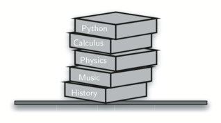
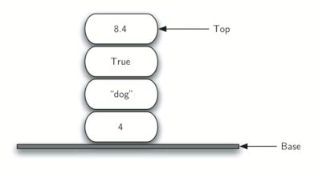
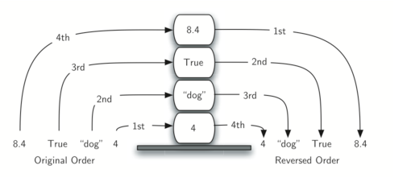
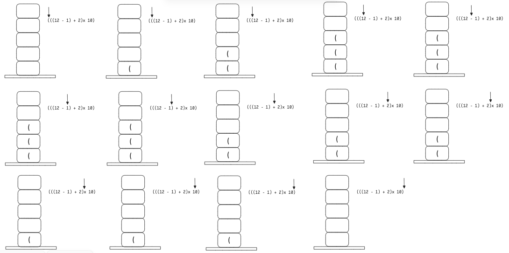
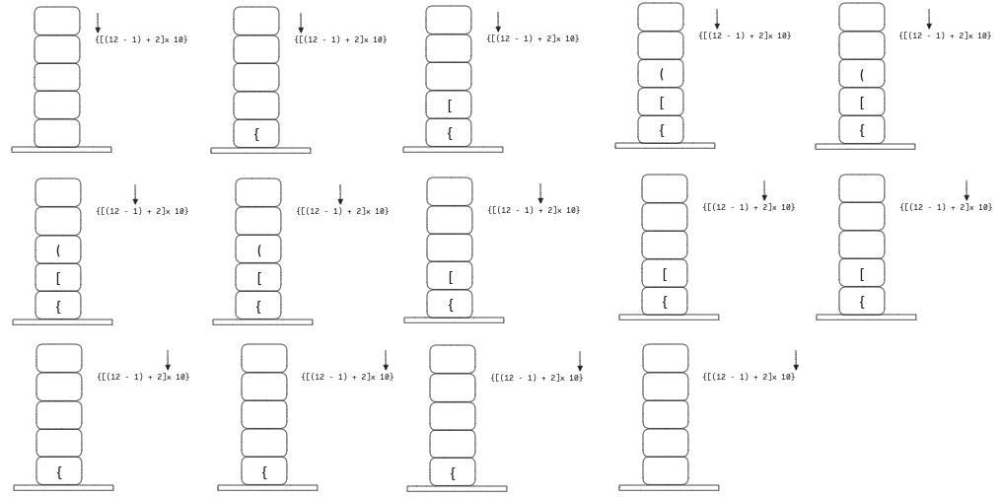
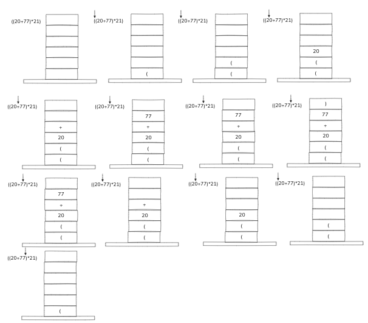
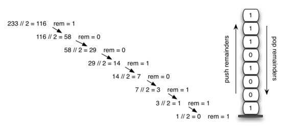
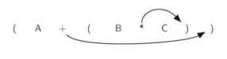
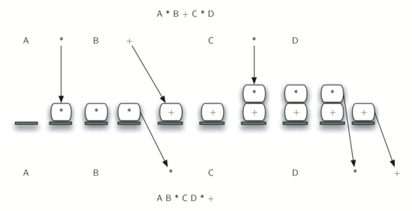

# Pilhas
- Uma **pilha** (_stack_) é uma **coleção ordenada** de itens onde a **inserção** de novos itens e a **remoção** de itens existentes sempre ocorrem **na mesma extremidade**
- Essa extremidade é chamada de **topo**,enquanto a extremidade oposta é chamada de **base** 
- Segue o princípio de ordenação **LIFO**(*last in first out*).
- Ou seja, O **último item inserido** é aquele que está na posição em que pode ser **removido primeiro**
- Enquanto,Os itens armazenados na pilha que estão **mais perto da base** são aqueles que estão na **pilha a mais tempo**
- Os itens estão armazenados de acordo com o **tempo de permanência** na estrutura. 
	- Itens **recentemente inseridos** na estrutura estão mais **.**
	- itens **mais antigos** na estrutura estão **perto da base**.

*Exemplo*:
> [!note] 
>Pilha de bandejas,Pilha de livros...
>Navegador: botão `Voltar`(*Back*)
>- À medida que você navega de uma página web para outra página, essas **páginas** são colocadas em uma **pilha** (na verdade, são as **URLs** que vão para a pilha). 
>- A **página atual** que você está visualizando está no **topo** e a **primeira página** que você olhou está na **base**. Se você clicar no botão `Voltar`, você começa a se mover pelas página na **ordem inversa**





- A ordem que eles são *removidos* é exatamente a **inversa da ordem** em que foram *colocados*. 
- As **pilhas** podem ser usadas para **reverter** a *ordem dos itens*. 
- A *ordem de inserção* é a **inversa** da *ordem de remoção*



### Tipo Abstrato de Dado
- `Stack()`: **Cria** uma nova pilha
	- Sem parâmetros
	- retorna uma pilha vazia
- `push(item)`: **Insere** um elemento na pilha (*Empilhar*)
	- Necessita do item a ser inserido
	- Sem retorno
- `pop()`: **Remove** o item que está no **topo** da pilha (*Desempilhar*)
	- Sem parâmetro
	- Retorna o item removido
	- A pilha é **modificada**
- `peek()`: **Retorna** o item no **topo** da pilha mas **não** o **remove** da pilha
	- Sem parâmetros
	- A pilha **não** é **modificada** 
- `isEmpty()`: **Testa** se a pilha está **vazia**
	- Sem Parâmetros
	- Retorna um booleano: `True or False`
- `size()`: **Retorna** o **número de itens** na pilha
	- Sem parâmetros 
	- Retorna um `int`

| Operações     | Conteúdo da Pilha     | Valor retornado |
| ------------- | --------------------- | --------------- |
| s.isEmpty()   | []                    | True            |
| s.push(4)     | [4]                   |                 |
| s.push('dog') | [4, 'dog']            |                 |
| s.peek()      | [4, 'dog']            | 'dog'           |
| s.push(True)  | [4, 'dog', True]      |                 |
| s.size()      | [4, 'dog', True]      | 3               |
| s.isEmpty()   | [4, 'dog', True]      | False           |
| s.push(8.4)   | [4, 'dog', True, 8.4] |                 |
| s.pop()       | [4, 'dog', True]      | 8.4             |
| s.pop()       | [4, 'dog']            | True            |
| s.size()      | [4, 'dog']            | 2               |

## Implementação de uma Pilha
- A implementação de um tipo abstrato de dados como uma pilha é feita através da criação de uma nova **classe**
- Consequentemente, as **operações** sobre uma pilha são implementadas como **métodos**
- Além disso, para implementar uma pilha, que é uma coleção de elementos, usaremos uma lista (`list`) e seus métodos.
 - Contudo,é preciso decidir qual **extremidade da lista** será considerado o **topo** da pilha e qual será a **base**
```python
# Pilha implementada usando o final da lista como topo.
# --> Os novos items serão inseridos ao final da lista
class Stack:
	# Construtor
	def __init__(self):
		self.itens = []
	# Métodos
	def isEmpty(self):
		return self.itens == []
	def push(self,item):
		return self.itens.append(item)
	def pop(self):
		return self.itens.pop()
	def peek(self):
		return self.itens[-1]
	def size(self):
		return len(self.itens)
```

>[!note]
>- O módulo `pythonds` contém **implementações** de todas as estruturas de dados discutidas neste livro. 
>- Está estruturado de acordo com as seções: básico, árvores e grafos. O módulo pode ser baixado de [pythonworks.org](http://www.pythonworks.org/pythonds).

```python
# from pythonds.basic.stack import Stack
# Exemplo
s = Stack()
print(s.isEmpty())
s.push(4)
s.push('Dog')
print(s.peek())
s.push(True)
print(s.size())
print(s.isEmpty())
s.push(8.4)
print(s.pop())
print(s.pop())
print(s.size())
```

- Poderíamos implementar uma pilha usando uma lista em que o **topo** estaria no **início** e **não** no final 
- Neste caso, seria necessário alterar os métodos `append()` e `pop()`.
	- `append()` → `insert(0,item)`  
	- `pop()` → `pop(0)`

```python
# Pilha implementada usando o inicio da lista como topo.
# --> Os novos items serão inseridos e removidos no inicio da lista
class Stack:
	# Construtor
	def __init__(self):
		self.itens = []
	# Métodos
	def isEmpty(self):
		return self.itens == []
	def push(self,item):
		return self.itens.insert(0,item)
	def pop(self):
		return self.itens.pop(0)
	def peek(self):
		return self.itens[0]
	def size(self):
		return len(self.itens)
```

>[!NOTE]
> - 1º Implementação: Cada execução de `push()` e `pop()` consome **tempo constante**,$O(1)$, **independentemente** do **número de itens** na pilha, já que `append()` e `pop()` são operações que consomem **tempo constante**.
> - 2º Implementação:O consumo de tempo de `push()` e `pop()` é **proporcional** ao **número n de itens** na pilha já que as operações `insert(0)` e `pop(0)` requererem tempo $O(n)$. 
### Exemplos:
#### Parênteses Balanceados
- **Problema:**  Verificar se uma expressão matemática contém apenas parênteses `()` corretamente balanceados, ou seja, se cada parêntese de abertura `(` possui um correspondente de fechamento `)` na ordem adequada.
- **Ideia de solução:**
	- Percorrer a string da expressão caractere por caractere.
	- Sempre que um parêntese de **abertura** `(` for encontrado, ele é adicionado à pilha.
	- Quando um parêntese de **fechamento** `)` for encontrado, é necessário verificar:
		- Se a pilha estiver **vazia**, significa que não há um parêntese de abertura correspondente → **inválido**.
		- Caso contrário, remove-se um elemento da pilha (parêntese de abertura correspondente).
	- Ao final, se a pilha estiver **vazia**, os parênteses estão corretamente balanceados → **válido**.

| Expressão     | Resultado  |
| ------------- | ---------- |
| (4 x 3)       | ✅ Válido   |
| )4 x 3(       | ❌ Inválido |
| ((3 + 2)      | ❌ Inválido |
| (1 + (2 * 3)) | ✅ Válido   |
| ()(()())      | ✅ Válido   |



```python
# Exemplo1: Parênteces Balanceados
def ehBalanceado(equacao):
	pilha = Stack()
	for i in equacao:
		if i == "(":
			pilha.push(i)
		elif i == ")":
			if pilha.isEmpty():
				return False
			else:
			pilha.pop()
	return pilha.isEmpty()
equacao = "( ( ( ) ) ) )"
print(ehBalanceado(equacao))
```
#### Símbolos Balanceados
- **Problema:**  Verificar se uma expressão matemática possui os parênteses — `()`, `[]`, `{}` — corretamente balanceados, ou seja, se cada símbolo de abertura possui um correspondente de fechamento na ordem adequada.
- **Ideia de solução:**
    - Percorrer a string da expressão caractere por caractere.
    - Sempre que um símbolo de **abertura** (`(`, `[`, `{`) for encontrado, ele é adicionado à pilha.
    - Quando um símbolo de **fechamento** (`)`, `]`, `}`) for encontrado, é necessário verificar:
        - Se a pilha está **vazia**, significa que não há símbolo de abertura correspondente → **inválido**.
        - Se o topo da pilha **não corresponde** ao símbolo de abertura equivalente, a estrutura está incorreta → **inválido**.
    - Ao final, se a pilha estiver **vazia**, todos os símbolos foram corretamente balanceados → **válido**.

| Expressão             | Resultado  |
| --------------------- | ---------- |
| (4 x 3)               | ✅ Válido   |
| )4 x 3(               | ❌ Inválido |
| ({3 x 4)}             | ❌ Inválido |
| {(3 x 4) - 1} x 2     | ✅ Válido   |
| {[(12 - 1) + 2] x 10} | ✅ Válido   |



```python
# Exemplo2: Símbolos Balanceados
def ehBalanceado(equacao):
	s = Stack()
	for i in equacao:
		if i == "{" or i == "[" or i == "(":
			s.push(i)
		elif i == "}" and (s.isEmpty() or s.pop() != "{"):
			return False
		elif i == "]" and (s.isEmpty() or s.pop() != "[" ):
			return False
		elif i == ")" and (s.isEmpty() or s.pop() != "("):
			return False
	return s.isEmpty()

equacao = "{[(12-1)+2]*10}"
print(ehBalanceado(equacao))
```

#### Símbolos Correspondentes
- **Problema:** Dada uma lista de expressões algébricas válidas, verificar se há algum símbolo de prioridade duplicado dentro de cada expressão.Exemplo: 5∗((1001+110)) é equivalente a 5∗(1001+110)  
*Exemplo*:  A expressão `5∗((1001+110))` possui parênteses duplicados, pois `((1001+110))` poderia ser reescrito como `(1001+110)` sem alterar o significado. 
- **Ideia de Solução:**
    1. Percorrer cada caractere da expressão:
        - Se for um símbolo de abertura (`(`, `[`, `{`), empilhar.
        - Se for um símbolo de fechamento (`)`, `]`, `}`):
            - Verificar o topo da pilha:
                - Se o topo for o símbolo de abertura correspondente, significa que não havia nada relevante entre o par de símbolos — logo, há duplicação.
                - Caso contrário, desempilhar todos os elementos até encontrar o símbolo de abertura correspondente, eliminando assim o conteúdo já verificado.                    
    2. Se algum caso de duplicação for encontrado, a função retorna `True`. Caso contrário, retorna `False`.



```python
def duplicada(simb_abre, simb_fecha, expressao):
    pilha = Stack()
    for caracter in expressao:
        if caracter == simb_fecha:
            if pilha.peek() == simb_abre:
                # Parênteses imediatamente fechados: duplicação
                return True
            else:
                while pilha.peek() != simb_abre:
                    pilha.pop()
                pilha.pop()  # Remove o símbolo de abertura também
        else:
            pilha.push(caracter)
    return False
```
#### Conversão de Decimal para Binário
- **Como converter Decimal → Binário?**
    - **Algoritmo de Divisão por 2:**
        - Enquanto o número decimal for maior que 0:
            - Divida por 2, guarde o **resto** em uma **pilha**.
            - O primeiro resto calculado será o **último dígito** do binário (menos significativo).
        - Ao final, desempilhe todos os restos para formar o número binário.
- **Por que usar uma pilha?**
    - A pilha reverte a ordem dos restos, garantindo a sequência correta dos dígitos binários.


```python
def divide_2(num_decimal):
    s = Stack()
    while num_decimal > 0:
        s.push(num_decimal % 2)
        num_decimal = num_decimal // 2
    # Impressao
    binString = ""
    while not s.isEmpty():
        binString += str(s.pop())
    return binString

print(divide_2(10))  # Saída: 1010
```
#### Conversão de Decimal para Qualquer Base (2 a 16)
- O mesmo algoritmo pode ser adaptado para converter para **qualquer base** (binário, octal, hexadecimal etc.).
- Basta substituir a divisão por 2 pela divisão pela **base desejada**
- Para bases acima de 10, utilizamos letras (`A` a `F`) para representar os valores.
**Exemplo de conversão:**
- `233` decimal = `351` octal = `E9` hexadecimal.
```python
def conversaoBase(num_decimal, base):
    s = Stack()
    while num_decimal > 0:
        s.push(num_decimal % base)
        num_decimal = num_decimal // base
    # Impressão
    digitos = "0123456789ABCDE"
    newString = ""
    while not s.isEmpty():
        newString += digitos[s.pop()]
    return newString

print(conversaoBase(25, 2))   # Saída: 11001
print(conversaoBase(25, 16))  # Saída: 19
```

#### Expressões Infixas, Prefixas e Posfixas
- **Infixas:** O operador aparece entre os dois operandos sobre os quais está atuando.
- Cada operador tem seu nível de **precedência**. 
	- Operadores de *maior* precedência são aplicados **antes** de operadores de *menor* precedência. 
	- **Parênteses** → muda essa ordem de precedência. 
	- \*,/ > +,- . 
	- Se dois operadores de precedência igual aparecem um após outro é utilizada uma ordenação ou associatividade da _esquerda para a direita_.
- Uma maneira de escrever uma expressão que garanta que não haverá confusão alguma com respeito a ordem em que as operações são executadas é criar uma expressão **totalmente parametrizada**.
- Este tipo de expressão usa um **par de parênteses** para cada **operador**. Os parênteses ditam a **ordem** em que as **operações são executadas**.
*Exemplo:* A + B * C + D → ((A + (B * C)) + D) ; A + B + C + D → (((A + B) + C) + D)
- **Prefixas**: Requer que todos os operadores **precedam** os dois **operandos** sobre os quais atuam
- **Posfixas**: Requer que seus operadores venham **depois** dos **operandos** correspondentes

>[!NOTE]
>As expressões **prefixas** e **posfixas** não requerem paranteceses para delimitar a precedência somente as **infixas**

| **Expressão Infixa** | **Expressão Prefixa** | **Expressão Posfixa** |
| -------------------- | --------------------- | --------------------- |
| A + B                | + A B                 | A B +                 |
| A + B * C            | + A * B C             | A B C * +             |
| (A + B) * C          | * + A B C             | A B + C *             |
| A + B * C + D        | + + A * B C D         | A B C * + D +         |
| (A + B) * (C + D)    | * + A B + C D         | A B + C D + *         |
| A \* B + C \* D      | + * A B * C D         | A B \* C D \* +       |
| A + B + C + D        | + + + A B C D         | A B + C + D +         |
#### Conversão Infixas → Prefixas e Posfixas
- Técnica: Expressão entre parênteses 
	- A + B * C → (A + (B * C))
	- Cada **par de parênteses** também determina o **início e o fim** de um **par de operandos** com o operador correspondente no meio.
	- Ao mover o operador para a posição do **parêntese direito** e **remover o parêntese esquerdo**, a subexpressão é convertida para a notação pós-fixa. Fazendo isso para todos os operadores, obtém-se a expressão pós-fixa completa
	


- Se fizermos a mesma coisa, mas em vez de mover o símbolo para a posição do parêntese direito, nós o movemos para a esquerda, obtemos a notação prefixa.


Expressão complexa: (A + B) * C - (D - E) * (F + G)


#### 📜 Algoritmo de Conversão Infixa → Pós-Fixa
1. **Inicialização**:
    - Cria uma pilha vazia (`s`)
    - Cria uma lista vazia para a expressão pós-fixa (`expressao_posfixa`)
    - Inicializa o índice em 0 para percorrer a expressão
2. **Processamento de cada caractere**:
    - Para cada caractere na expressão de entrada:  
        a. **Números multi-dígitos**: Verifica se o caractere atual e o próximo são dígitos, concatenando-os  
        b. **Operadores (+, -, *, /)**:
        - Para `+` e `-`: desempilha todos os operadores até encontrar "(" ou a pilha esvaziar
        - Para `*` e `/`: desempilha apenas o topo da pilha (precedência maior)
        - Empilha o novo operador  
            c. **Parêntese esquerdo "("**: Simplesmente empilha  
            d. **Parêntese direito ")"**: Desempilha tudo até encontrar o "(" correspondente  
            e. **Outros casos (números)**: Adiciona diretamente à saída
3. **Finalização**:    
    - Desempilha todos os operadores restantes na pilha
    - Retorna a expressão pós-fixa



```python
def posfixa(equacao):
	s = Stack()
	expressao_posfixa = [] # Saída final da expressão
	index = 0
	while index < len(equacao):
		caracter = equacao[index]
		# Juntar caracteres com mais de um digito
		if caracter.isdigit():
			while (index + 1 < len(equacao)) and equacao[index+1].isdigit():
				caracter += equacao[index + 1]
				index += 1
			expressao_posfixa.append(caracter)
		elif caracter in "+-*/":
			# Determinar precedência
			prec_caracter = 1 if caracter in '+-' else 2
			while (not s.isEmpty()) and (s.peek() != "("):
				prec_topo = 1 if s.peek() in '+-' else 2
				if prec_topo >= prec_caracter:
					expressao_posfixa.append(s.pop())
				else:
					break
			s.push(caracter)
		elif caracter == "(":
			s.push(caracter)
		elif caracter == ")":
			while not s.isEmpty() and s.peek() != "(":
				expressao_posfixa.append(s.pop())
			s.pop() # Remove o "(" da pilha
		index += 1
		
# Desempilha todos os operadores restantes
	while not s.isEmpty():
		expressao_posfixa.append(s.pop())
		
return expressao_posfixa
```
#### Calculadora
Para avaliar uma expressão em notação pós-fixa (posfixa), usamos uma pilha. Durante a leitura da expressão da esquerda para a direita:
- **Operandos** são empilhados.
- **Operadores** acionam a retirada (`pop()`) dos dois operandos mais recentes para aplicar a operação.
- O resultado é então empilhado novamente.

*Exemplo:* 4 5 6 * +
- Empilha 4 e 5.
- Empilha 6.
- Ao encontrar `*`, multiplica 5×6 = 30 e empilha o resultado.    
- Ao encontrar `+`, soma 4+30 = 34.


*Exemplo:* 7 8 + 3 2 + /


```python
def calcula(posfixa):
	s = Stack()
	for c in posfixa:
		if c == "+":
			operando2 = s.pop()
			operando1 = s.pop()
			s.push(operando1 + operando2)
		elif c == "-":
			operando2 = s.pop()
			operando1 = s.pop()
			s.push(operando1 - operando2)
		elif c == "*":
			operando2 = s.pop()
			operando1 = s.pop()
			s.push(operando1 * operando2)
		elif c == "/":
			operando2 = s.pop()
			operando1 = s.pop()
			s.push(operando1 / operando2)
		else:
			s.push(int(c))
	return s.pop()
```