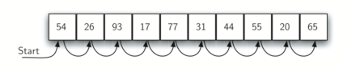
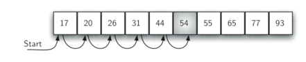
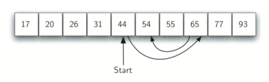
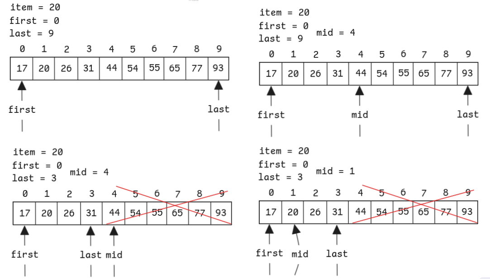
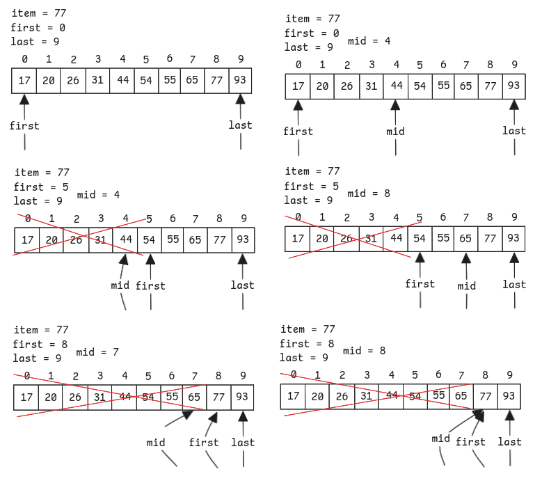
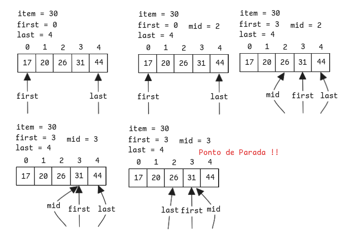

# Busca
**Busca** é o processo algorítmico de encontrar um **item específico** numa **coleção de itens**.   
Normalmente, **Retorna** `True` (item está presente) ou `False` (item **não** está presente)   
Pode ser modificada em algumas situações para retornar o **elemento** encontrado.

Em Python, é possível usar o operador `in` para verificar se um item está presente numa lista de itens.

```python
>>> 15 in [3,5,2,4,1]
False
>>> 3 in [3,5,2,4,1]
True
>>>
```

## Busca Sequencial
Quando os itens de dados são armazenados numa coleção tal qual uma lista, eles possuem uma relação linear ou sequencial. 
- Cada item de dado é armazenado numa **posição relativa** aos demais. 
- Essas posições relativas são os **índices** dos itens individuais. 

Assim, é possível ir percorrendo um à um (de maneira **sequencial**) até encontrar o item desejado.
- Quando não há mais itens, então chegamos à conclusão de que o item buscado **não** estava presente.



```python
def sequentialSearch(alist, item):
    pos = 0
    found = False
    
    while pos < len(alist) and not found:
        if alist[pos] == item:
            found = True
        else:
            pos = pos + 1
    
    return found

# Exemplo de Uso
testlist = [1, 2, 32, 8, 17, 19, 42, 13, 0]
print(sequentialSearch(testlist, 3))
print(sequentialSearch(testlist, 13))
```

### Análise 
No caso da busca, faz sentido contar o número de **comparações** realizadas como unidade básica de computação.   
Cada comparação pode (ou não) encontrar o item buscado.   
**Obs:**  
I. A lista **não** está **ordenada**.  
II. Os itens estão dispostos **aleatoriamente**, com igual probabilidade de o item estar em qualquer posição

Se o item **não está presente** na lista com `n` elementos, então serão necessárias `n` comparações para ter certeza de sua ausência.

Se o item **está presente**, temos três cenários:
- **Melhor caso**: item está na primeira posição → 1 comparação
- **Pior caso**: item está na última posição → `n` comparações
- **Caso médio**: item está, em média, na metade da lista → `n/2` comparações

Para valores grandes de `n`, os coeficientes tornam-se menos relevantes e dizemos que a **complexidade da busca sequencial é $O(n)$**.

| Item         | Melhor Caso | Caso Médio | Pior Caso |
| ------------ | ----------- | ---------- | --------- |
| Presente     | 1           | n / 2      | n         |
| Não presente | n           | n          | n         |

Suponha agora que a lista foi feita de tal maneira que os itens estão posicionados de forma crescente.  
Neste caso, existe uma melhoria para caso de o item **não estar presente** na lista, para os outros casos continua a mesma. 



**Exemplo:** Procurar o item 50 na lista apresenta acima.  
Os elementos continuam sendo procurados de maneira sequencial, contudo ao encontrar o 54 verifica-se que **não é possível** que o nosso item esteja em alguma posição superior a 54, pois a lista está **ordenada**.   
Nesse caso, o algoritmo não precisa continuar procurando no restante da lista para informar que o item não foi encontrado. Ele pode **parar imediatamente**.

```python
def orderedSequentialSearch(alist, item):
    pos = 0
    found = False

    while pos < len(alist) and not found:
        if alist[pos] == item:
            found = True
        elif alist[pos] > item:
            break
        else:
            pos += 1

    return found
```

```python
def orderedSequentialSearch(alist, item):
    pos = 0
    found = False
    stop = False

    while pos < len(alist) and not found and not stop:
        if alist[pos] == item:
            found = True
        else:
            if alist[pos] > item:
	                stop = True
            else:
                pos = pos+1
	
    return found

testlist = [0, 1, 2, 8, 13, 17, 19, 32, 42,]
print(orderedSequentialSearch(testlist, 3))
print(orderedSequentialSearch(testlist, 13))
```

## Busca Binária
É possível obter uma **grande vantagem** quando uma lista está **ordenada**, se usarmos uma estratégia mais **eficiente de comparação**.  
Na busca sequencial, partimos do primeiro item e percorremos até o fim, mas isso pode exigir até `n` **comparações**.  
A **busca binária**, por outro lado, utiliza a estratégia de **dividir para conquistar**, o que a torna significativamente mais eficiente.

### Funcionamento
A busca binária começa verificando o **item central** da lista ordenada:

- Se o item do meio é o que procuramos, a busca termina.
- Se o item procurado for **menor**, descartamos a metade **superior** da lista.
- Se for **maior**, descartamos a metade **inferior**.

Esse processo continua **recursivamente** ou **iterativamente**, reduzindo pela metade o espaço de busca a cada passo.





#### Busca Binária - Interativa
```python
def binarySearch(alist, item):
    first = 0
    last = len(alist)-1
    found = False
	
    while first <= last and not found:
    midpoint = (first + last) // 2
        if alist[midpoint] == item:
            found = True
        else:
            if item < alist[midpoint]:
                last = midpoint - 1
            else:
                first = midpoint+1

    return found

# Exemplo de Uso
testlist = [0, 1, 2, 8, 13, 17, 19, 32, 42,]
print(binarySearch(testlist, 3))
print(binarySearch(testlist, 13))
```



#### Busca Binária - Recursiva
```python
def binarySearchRecursive(alist, item):
    # Ponto de parada: lista vazia, item não encontrado
    if len(alist) == 0:
        return False
    else:
        midpoint = len(alist) // 2
        # Item encontrado
        if alist[midpoint] == item:
            return True  
        else:
            if item < alist[midpoint]:
                # Procura na metade inferior (esquerda)
                # alist[:midpoint] cria uma sublista do início até midpoint-1
                return binarySearchRecursive(alist[:midpoint], item)
            else:
                # Procura na metade superior (direita)
                # alist[midpoint+1:] cria uma sublista de midpoint+1 até o final
                return binarySearchRecursive(alist[midpoint+1:], item)
```



#### Busca Binária - Recursiva (versão 02) 
```python
def binarySearchRecursive(alist, item, first = None, last = None):
    if first is None:
        first = 0
    if last is None:
        last = len(alist) - 1

    # Ponto de parada: item não está na lista
    if first > last:
        return False

    midpoint = (first + last) // 2

    if item == alist[midpoint]:
        return True
    elif item < alist[midpoint]:
        return binarySearchRecursive(alist, item, first, midpoint - 1)
    else:
        return binarySearchRecursive(alist, item, midpoint + 1, last)

assert binarySearchRecursive([1, 3, 5, 7, 9], 7) == True
assert binarySearchRecursive([1, 3, 5, 7], 3) == True
assert binarySearchRecursive([1, 3, 5, 7], 4) == False
assert binarySearchRecursive([], 1) == False
```

### Análise 
A cada passo, o tamanho do problema é **dividido pela metade**:

- **Melhor caso**: o item está no meio → 1 comparação.
- **Pior caso**: `log₂(n)` comparações até encontrar (ou não) o item.

Portanto, a **complexidade da busca binária é $O(\log n)$**, o que a torna muito mais eficiente do que a busca sequencial, especialmente em listas grandes.
