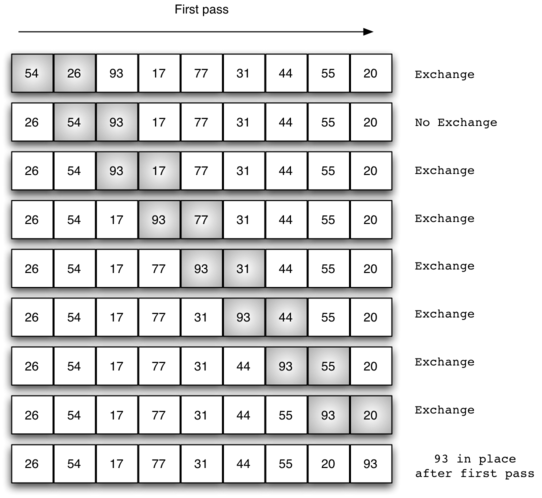
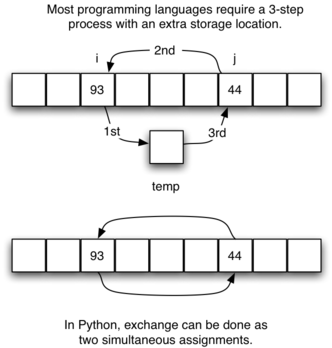

# Ordenação
**Ordenação** é o processo de colocar elementos de uma coleção em uma determinada ordem.  
*Exemplos*:  
- Lista de palavras ordenadas alfabeticamente ou por comprimento 
- Lista de cidades ordenadas por população, área ou CEP.

A **ordenação** é uma área **fundamental** da ciência da computação haja vista a existência de vários algoritmos desenvolvidos e analisados sobre essa temática

A **eficiência** de um algoritmo de ordenação depende da **quantidade de elementos** sendo processados. Assim, Para coleções pequenas, um algoritmo simples pode ser mais prático. Mas para grandes volumes de dados, algoritmos mais eficientes podem economizar tempo e recursos.

#### Operações básicas
1. **Comparação de elementos** – é necessário comparar dois valores para determinar qual é maior ou menor. O **número de comparações** realizadas é uma métrica comum para avaliar o **desempenho** de um algoritmo de ordenação.

2. **Troca de elementos** – quando dois valores estão fora de ordem, é preciso trocá-los. Essa operação também é custosa, e o número total de trocas influencia a eficiência geral do processo.

## Bubble Sort
O **Bubble Sort** realiza múltiplas passagens por uma lista. Em cada passagem, ele **compara elementos adjacentes** e os **troca de posição** se estiverem fora de ordem.   
A cada nova iteração, o maior valor entre os não ordenados “sobe” como uma bolha até a sua posição correta.

Na **primeira passagem** Os itens destacados são os que estão sendo comparados. Se existem `n` elementos, teremos `n - 1` comparações na primeira passagem. 

O **maior elemento** é "empurrado" até o **final da lista**.



No início da **segunda passagem**, o **maior valor** já está **ordenado**. Ainda assim, restam `n - 1` elementos para ordenar, com `n - 2` comparações. Esse processo continua até que toda a lista esteja ordenada após `n - 1` passagens.

#### Troca de Elementos
A operação de *troca* ou *swap* é importante em algoritmos de ordenação. 

Tradicionalmente, usamos uma variável temporária:
```python
temp = alist[i]
alist[i] = alist[j]
alist[j] = temp
```

Em Python, no entanto, é possível usar **atribuições simultâneas**:
```python
alist[i], alist[j] = alist[j], alist[i]
```



```python
def bubble_sort(alist):
    for i in range(len(alist) - 1, 0, -1):  # Iterações necessárias
        for j in range(i):  # Comparações em cada iteração
            if alist[j] > alist[j + 1]:
                # Swap com Variável Temporária
                '''
                temp = alist[i]
                alist[i] = alist[i+1]
                alist[i+1] = temp
                '''
                # Swap sem Variável Temporária
                alist[j], alist[j + 1] = alist[j + 1], alist[j]
    return alist

# Exemplo de Uso
alist = [54, 26, 93, 17, 77, 31, 44, 55, 20]
alist = bubble_sort(alist)
print(alist)
```

### Análise
O **Bubble Sort** realiza sempre `n - 1` passagens, independentemente da ordem inicial da lista. O número de comparações por passagem é:

| Passagem | Comparações |
| -------- | ----------- |
| 1        | `n - 1`     |
| 2        | `n - 2`     |
| 3        | `n - 3`     |
| ...      | ...         |
| `n - 1`  | 1           |

A soma total de comparações é:

$$
\sum_{i=1}^{n-1} i = \frac{n^2 - n}{2} \Rightarrow \mathcal{O}(n^2)
$$

Complexidade:
- **Pior caso** : $\mathcal{O}(n^2)$ [ lista invertida ].
- **Melhor caso** (com otimização swapped): $\mathcal{O}(n)$ [ lista já ordenada ].

### Versão Otimizada
Caso **nenhuma troca ocorra** durante uma passagem, podemos concluir que a **lista já está ordenada**, e o algoritmo pode ser encerrado mais cedo.

```python
def bubble_sort(alist):
    for i in range(len(alist) - 1, 0, -1):
        swapped = False
        for j in range(i):
            if alist[j] > alist[j + 1]:
                alist[j], alist[j + 1] = alist[j + 1], alist[j]
                swapped = True
        if not swapped:  # Se não houve trocas, a lista está ordenada
            break
    return alist
```

## Selection Sort

### Análise

## Insertion Sort

### Análise

## Shell Sort

### Análise

## Merge Sort

### Análise

## Quick Sort

### Análise