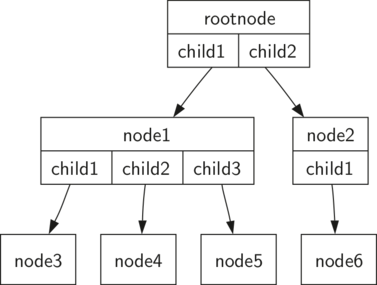

# Árvores
**Árvores** são usadas em diversas áreas da *Ciência da Computação* como sistemas operacionais, banco de dados, rede de computadores, computação gráfica.  
Tem bastante semelhança com a árvore botânica possuindo **raiz**, **folhas**, **"galhos"/ramificações**.  
**Obs :** Na *Computação* **raiz** fica no **topo** enquanto a **folhas** ficam na **base**.

## Exemplos de Árvores

### 1. Árvore Filogenética
A primeira **propriedade** que esse exemplo demostra é que as árvores são **hierárquicas**.  
Ou seja, as árvores são organizadas em **níves** com os elementos mais gerais ficando perto do **topo/raiz** (como o Reino) e os mais específicos na **base/folhas** (como Espécie).  
A segunda **propriedade** das árvores é que os filhos de um nó são **independentes** dos filhos de outros nós.  
Por exemplo, o gênero Felis tem os filhos Domestica e Leo. Já o gênero Musca também tem um filho chamado Domestica, mas trata-se de um nó diferente e independente do outro Domestica.  
A terceira **propriedade** é que cada nó da árvore é **único**. É possível seguir um caminho desde a raiz até uma folha para identificar de forma única uma espécie.  
Por Exemplo, Animalia > Chordata > Mammalia > Carnivora > Felidae > Felis > Domestica.


### 2. Sistema de Arquivo
Em um sistema de arquivos, os diretórios (ou pastas) são organizados como uma **árvore**.


É possível seguir um caminho a partir da **raiz** até qualquer **diretório**. Esse caminho **identificará** de **forma única** aquele subdiretório (e todos os arquivos contidos nele).   
Outra **propriedade** importante das árvores, derivada de sua natureza hierárquica, é que é possível **mover seções** inteiras de uma árvore (chamadas de **subárvores**) para uma **posição diferente** na árvore **sem afetar** os níveis **inferiores** da hierarquia.   
Por exemplo, poderíamos pegar toda a subárvore que começa com `/etc/`, desconectar `etc/` da raiz e reconectá-la sob `usr/`. Isso mudaria o caminho único de httpd de /etc/httpd para `/usr/etc/httpd`, mas **não afetaria o conteúdo** nem os **filhos do diretório** httpd.

### 3. HTML Tags 
Uma página da web simples escrita em HTML também utiliza árvore.

```html
<html xmlns="http://www.w3.org/1999/xhtml"
      xml:lang="en" lang="en">
<head>
    <meta http-equiv="Content-Type"
          content="text/html; charset=utf-8" />
    <title>simple</title>
</head>
<body>
<h1>A simple web page</h1>
<ul>
    <li>List item one</li>
    <li>List item two</li>
</ul>
<h2><a href="http://www.cs.luther.edu">Luther CS </a><h2>
</body>
</html>
```


O código-fonte HTML e a árvore que o acompanha ilustram outra hierarquia. Note que cada **nível da árvore** corresponde a um **nível de aninhamento** dentro das tags HTML.  
A primeira tag no código-fonte é `<html>` e a última é `</html>`.   
Todas as outras tags da página estão **contidas** dentro desse par. Se você verificar, verá que essa propriedade de aninhamento é válida para todos os níveis da árvore.

## Vocabuário e Definições

### Nó (Node)
Parte **fundamental** de uma árvore. Ele pode ter um nome, que chamamos de “chave” (key). Pode conter **informações adicionais**, chamadas de “carga útil” (payload).   
Embora a carga útil não seja central para muitos algoritmos de árvore, ela costuma ser essencial em **aplicações** que fazem uso dessas estruturas.


### Aresta (Edge)
**Conecta** dois nós para mostrar que existe uma **relação** entre eles.  
Cada nó (exceto a raiz) é conectado por **exatamente** uma aresta de **entrada** vinda de outro nó. Um nó pode ter **várias arestas** de **saída**.


### Raiz (Root)
A raiz da árvore é o único nó que **não** possui arestas de entrada


### Caminho (Path)
Um caminho é uma **lista ordenada** de **nós conectados** por arestas.  
Por exemplo, 1 --> 2 --> 6.


### Filhos (Children)
O **conjunto de nós** que possuem **arestas de entrada** vindas do **mesmo nó** são chamados de filhos desse nó.   
Por exemplo, Os Nós **Vermelhos** são filhos do nó **Azul**.


### Pai (Parent)
Um nó é o pai de todos os nós aos quais está **conectado por arestas de saída**.  
Por exemplo, O Nó **Azul** é pai dos nós **Vermelhos**


### Irmãos (Siblings)
Nós que são **filhos do mesmo pai** são chamados de irmãos.  
Por exemplo, Os Nós **Vermelhos** são irmãos.


### Subárvore (Subtree)
Uma subárvore é um **conjunto de nós** e arestas formado por **um nó pai e todos os seus descendentes**.


### Nó Folha (Leaf Node)
Um nó folha é um nó que **não possui filhos**.


### Nível (Level)
O nível de um nó é o **número de arestas** no **caminho** da **raiz** até esse **nó**.


### Altura (Height)
A altura de uma árvore é **igual** ao **maior nível** de **qualquer nó** da árvore.  
Nesse exemplo, `altura = 2`


### Definição (01)
Uma *árvore* consiste em um **conjunto de nós** e um **conjunto de arestas** que conectam **pares de nós**.   

**Propriedades:**
- Um dos nós é designado como o **nó raiz**.
- Cada nó, **exceto a raiz**, é conectado por uma aresta a exatamente um outro nó, que é seu pai.
- Existe um **caminho único** que parte da raiz até cada nó.
- Se cada nó da árvore tiver no **máximo dois filhos**, dizemos que a árvore é uma *árvore binária*.



### Definição (02)
Uma árvore pode ser **vazia** ou composta por um **nó raiz** e **uma ou mais subárvores**.  
Cada **subárvore**, por sua vez, também é uma **árvore**, e **sua raiz** está ligada **à raiz da árvore principal** por uma aresta.


## Representação - Listas
Em uma árvore representada por **lista de listas** será da seguinte forma:  
**1º Elemento** : Armazena o **valor** do nó raiz.  
**2º Elemento** : Uma lista que representa a **subárvore** à **esquerda**.  
**3º Elemento** : Uma lista que representa a **subárvore** à **direita**. 

```python []
myTree = ['a',   # raiz
      ['b',  # subárvore esquerda
       ['d', [], []],
       ['e', [], []] ],
      ['c',  # subárvore direita
       ['f', [], []],
       [] ]
     ]
```


Note que podemos acessar as subárvores da lista utilizando **indexação** padrão de listas.
- myTree[0] = **raiz** da árvore
- myTree[1] = **subárvore à esquerda** da raiz
- myTree[2] = **subárvore à direita** da raiz

```python []
myTree = ['a', ['b', ['d',[],[]], ['e',[],[]] ], ['c', ['f',[],[]], []] ]
print(myTree)
print('left subtree = ', myTree[1])
print('root = ', myTree[0])
print('right subtree = ', myTree[2])
```

### Vantagens
A estrutura da lista que representa uma **subárvore** segue a mesma estrutura definida para uma árvore.  
Ou seja, a **estrutura é recursiva!** Uma subárvore que possui um **valor de raiz** e **duas listas vazias** representa um **nó folha**.

Outra vantagem dessa abordagem é que ela pode ser **generalizada** para árvores com mais de duas subárvores, basta adicionar outra **subárvore** como **mais uma lista**.

### Definição
Vamos fornecer algumas **funções** que facilitam o uso de listas como árvores.  
**Obs** : **Não** vamos definir uma classe para **árvore binária**.   
As funções que escreveremos apenas nos ajudarão a manipular uma lista padrão como se estivéssemos trabalhando com uma árvore.

```python []
def BinaryTree(r):
    return [r, [], []]
```

A função `BinaryTree` constrói uma lista com um **nó raiz** e **duas sublistas vazias** para os filhos. 

Para adicionar uma **subárvore à esquerda** da raiz de uma árvore, precisamos **inserir uma nova lista** na **segunda posição** da lista raiz. 

**OBS :** Se já houver algo nessa posição, é preciso **preservar esse conteúdo** e **empurrá-lo para baixo** na árvore como **filho esquerdo** do **novo nó** que estamos inserindo.

```python []
def insertLeft(root, newBranch):
    t = root.pop(1)
    if len(t) > 1:
        root.insert(1, [newBranch, t, []])
    else:
        root.insert(1, [newBranch, [], []])
    return root
```

Analogamente para a **subárvore à direita**

```python []
def insertRight(root, newBranch):
    t = root.pop(2)
    if len(t) > 1:
        root.insert(2, [newBranch, [], t])
    else:
        root.insert(2, [newBranch, [], []])
    return root
```

Outras funções de **acesso** para **obter** e **alterar** o **valor da raiz**, bem como obter as **subárvores à esquerda** e **à direita**.

```python
def getRootVal(root):
    return root[0]

def setRootVal(root, newVal):
    root[0] = newVal

def getLeftChild(root):
    return root[1]

def getRightChild(root):
    return root[2]
```

*Exemplo* 

```python []
r = BinaryTree(3)
insertLeft(r,4)
insertLeft(r,5)
insertRight(r,6)
insertRight(r,7)
l = getLeftChild(r)
print(l)

setRootVal(l,9)
print(r)
insertLeft(l,11)
print(r)
print(getRightChild(getRightChild(r)))

'''
Saída
[5, [4, [], []], []]
[3, [9, [4, [], []], []], [7, [], [6, [], []]]]
[3, [9, [11, [4, [], []], []], []], [7, [], [6, [], []]]]
[6, [], []]
'''
```

## Representação - Nós e Referências
Outra forma de repesentar uma Árvore é usando **nós** (`Nodes`) e **referências** (`References`)

Vamos definir uma classes com os seguintes atributos: 
- Valor da raíz (`root`) 
- As referências para as subárvores (`subtree`) da direita e da esquerda.


```python []
class BinaryTree:
    def __init__(self, rootObj):
        self.key = rootObj
        self.leftChild = None
        self.rightChild = None
```

### Métodos

I. **Inserir** novos elementos além da raíz 

1. Verificar se o nó já possui um filho à esquerda ou à direita    
2. Se **não** há filho, simplesmente adicionamos um novo nó à árvore
3. Caso contrário, inserimos um **novo nó** e **empurramos** o filho existente um **nível abaixo** na árvore.

```python []
def insertLeft(self, newNode):
    if self.leftChild == None:
        self.leftChild = BinaryTree(newNode)
    else:
        t = BinaryTree(newNode)
        t.leftChild = self.leftChild
        self.leftChild = t

def insertRight(self, newNode):
    if self.rightChild == None:
        self.rightChild = BinaryTree(newNode)
    else:
        t = BinaryTree(newNode)
        t.rightChild = self.rightChild
        self.rightChild = t
```

Além disso, podemos adcionar métodos para **acessar os valores** filhos da esquerda e da direita

```python []
    def getRightChild(self):
        return self.rightChild

    def getLeftChild(self):
        return self.leftChild

    def setRootVal(self,obj):
        self.key = obj

    def getRootVal(self):
        return self.key
```

## Árvores de Análise Sintática (Parse Tree)
A seguir veremos um exemplo de como árvores podem ser usadas para resolver problemas reais.

**Exemplo01:** *Estrutura hierárquica* de uma sentença simples. Ao representar uma sentença como uma estrutura de árvore nos permite trabalhar com as **partes individuais** da sentença por meio de **subárvores**.


**Exemplo02:** Expressão Numérica - ( 3 + ( 4 * 5 ) )


Sabemos que a multiplicação tem prioridade sobre a adição. Os parênteses nos mostram a ordem correta de cálculo.   
A **hierarquia da árvore** nos ajuda a visualizar essa **ordem**: primeiro resolvemos as subexpressões (como o 4 * 5), depois somamos com o 3.  
Ao resolver cada parte, podemos substituir os ramos da árvore por um **único nó**, deixando a árvore mais simples 


### Construção da Árvores de Análise (Parse Trees)
Para construir uma árvore a partir de uma expressão como ( 3 + ( 4 * 5 ) ), seguimos estes passos:

#### Tipos de tokens:
- `(` --> **início** de uma **nova subárvore**
- `)` --> **fim** de uma **subárvore**
- Operadores --> `(+, -, *, /)`
- Operandos --> `(Números)`

#### Regras de Construção:
1. **Se for** `(`: Crie um novo **nó à esquerda** e desça.
2. **Se for Operador**: Defina como valor do nó atual, crie um nó **à direita** e desça.
3. **Se for Número**: Atribua ao nó atual e suba.
4. **Se for** `)`: Suba para o nó pai.

#### *Exemplo*:
Expressão: ( 3 + ( 4 * 5 ) )  
Tokens: `['(', '3', '+', '(', '4', '*', '5', ')', ')']`

1. Cria Árvore vazia


2. Lê `(` : Novo nó à esquerda


3. Lê `3` : Define valor e sobe


4. Lê `+` : Define valor, cria nó à direita e desce


5. Lê `(` : Novo nó à esquerda


6. Lê `4` : Define valor e sobe


7. Lê `*` : Define valor, novo nó à direita e desce


8. Lê `5` : Define valor e sobe
9. Lê `)` : Sobe
10. Lê `)` : Sobe --> fim da construção


#### Gerenciando a construção da árvore
Durante a construção da árvore de análise, é necessário acompanhar:
- O **nó atual**
- E seu **pai**

A Árvore permite acessar apenas osfilhos (com `getLeftChild` e `getRightChild`), mas **não** os pais diretamente.

**Solução** : Usar uma **Pilha (Stack)** para guardar os nós enquanto descemos na árvore.

```python []
def buildParseTree(fpexp):
    fplist = fpexp.split()
    pStack = Stack()
    eTree = BinaryTree('')
    pStack.push(eTree)
    currentTree = eTree

    for i in fplist:
        if i == '(':
            currentTree.insertLeft('')
            pStack.push(currentTree)
            currentTree = currentTree.getLeftChild()
        elif i in ['+', '-', '*', '/']:
            currentTree.setRootVal(i)
            currentTree.insertRight('')
            pStack.push(currentTree)
            currentTree = currentTree.getRightChild()
        elif i == ')':
            currentTree = pStack.pop()
        else:  # número
            currentTree.setRootVal(int(i))
            currentTree = pStack.pop()

    return eTree
```

#### Avaliação Recursiva da Árvore
Cada **subárvore** representa uma operação. A função `evaluate`:
- Retorna diretamente o valor se o nó for uma **folha** (número).
- Caso contrário, avalia os dois filhos recursivamente e aplica o **operador** no nó pai.

```python [] 
import operator

def evaluate(parseTree):
    opers = {'+': operator.add, '-': operator.sub, '*': operator.mul, '/': operator.truediv}
    leftC = parseTree.getLeftChild()
    rightC = parseTree.getRightChild()

    if leftC and rightC:
        fn = opers[parseTree.getRootVal()]
        return fn(evaluate(leftC), evaluate(rightC))
    else:
        return parseTree.getRootVal()
```

## Travessias 
Existem **três padrões** comumente usados para **visitar** todos os **nós** de uma árvore.  
A **diferença** entre esses padrões está na **ordem** em que cada nó é visitado.  
Esse processo é chamado de **Percurso/Travessia** (traversal).  

Os três percursos que veremos são chamados de **pré-ordem**, **em ordem** e **pós-ordem**.  

O código para escrever as travessias é supreendemente **elegante** pois são escritos de forma recursiva.  

**Obs :** Existem duas maneiras de escrever as travessias que são usando função **externa** que recebe uma árvore binária como parâmetro ou criar um próprio **método** da árvore.    

Normalmente, é melhor implementar o percurso como uma função **externa** pois raramente se deseja apenas percorrer a árvore.   

Na maioria dos casos, queremos fazer algo enquanto utilizamos um dos padrões básicos de percurso.

### Pré-Ordem
Visitamos o **nó raiz** primeiro, depois fazemos **recursivamente** um percurso em pré-ordem da **subárvore esquerda**, seguido por um percurso recursivo da **subárvore direita**.

```python
# Usando função externa
def preorder(tree):
    if tree:
        print(tree.getRootVal())
        preorder(tree.getLeftChild())
        preorder(tree.getRightChild())
```

```python
# Usando como método
def preorder(self):
    print(self.key)
    if self.leftChild:
        self.leftChild.preorder()
    if self.rightChild:
        self.rightChild.preorder()
```

### In-Ordem
Fazemos **recursivamente** um percurso em ordem da **subárvore esquerda**, visitamos o **nó raiz**, e por fim fazemos um percurso **recursivo** da **subárvore direita**.

```python
def postorder(tree):
    if tree != None:
        postorder(tree.getLeftChild())
        postorder(tree.getRightChild())
        print(tree.getRootVal())
```

### Pós-Ordem
Fazemos **recursivamente** um percurso pós-ordem da **subárvore esquerda** e da **subárvore direita**, seguido de uma visita ao **nó raiz**.

```python
def inorder(tree):
    if tree != None:
        inorder(tree.getLeftChild())
        print(tree.getRootVal())
        inorder(tree.getRightChild())
```

