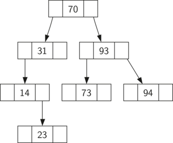

# Árvores Binárias de Busca

## Definição
Árvores Binárias de Busca (Binary Search Trees - BST) são estruturas de dados que armazenam pares **chave-valor** de forma organizada, permitindo **buscas eficientes**.

Cada nó da árvore segue a propriedade:
- A chave da **subárvore esquerda** é **menor** que a do nó atual.
- A chave da **subárvore direita** é **maior** que a do nó atual.

Essa estrutura é usada como uma alternativa às **listas ordenadas com busca binária** e às **tabelas de dispersão (hash tables)** para implementar o **tipo abstrato de dados de mapa (Map ADT)**.


## Operações Básicas (Interface do Map)
A interface de uma árvore binária de busca é semelhante à de um dicionário em Python:

- `Map()` : Cria um novo mapa vazio.

- `put(key, val)` : Adiciona um par chave-valor ao mapa. 
    - Substitui o valor se a chave já existir.

- `get(key)` : Retorna o valor associado à chave. 
    - Se a chave não existir, retorna `None`.

- `del map[key]` : Remove o par chave-valor correspondente à chave.

- `len(map)` : Retorna o número de pares armazenados no mapa.

- `key in map` : Retorna `True` se a chave existir no mapa.

## Implementação



Neste exemplo, a **ordem de inserção** é : 70, 31, 93, 94, 14, 23

> 1. Como **70** foi a **primeira chave** inserida, ela se torna a **raiz**.
> 2. **31** é *menor* que 70, então se torna o filho **à esquerda** de 70.
> 3. **93** é *maior* que 70, então se torna o filho **à direita** de 70.
> 4. **94** é *maior* que 70 e também *maior* que 93, então vai para **a direita de 93**.
> 5. **14** é *menor* que 70 e menor que 31, então vai para **a esquerda de 31**.
> 6. **23** é *menor* que 31, mas maior que 14, então vai para **a direita de 14**.

Para implementar uma árvore binária de busca utilizaremos a mesma abordagem com **nós** e **referências**.A Implementação usará **duas classes** : 

### `BinarySearchTree` 
- Representa a árvore.   
- Mantém **referência** para o nó raiz (`TreeNode`)   
- Controla o tamanho da árvore.  

```python
class BinarySearchTree:

def __init__(self):
    self.root = None
    self.size = 0

def length(self):
    return self.size

def __len__(self):
    return self.size

def __iter__(self):
    return self.root.__iter__()
```

### `TreeNode` 
- Representa os **nós** da árvore.
- Fornece várias **funções auxiliares** que tornam mais simples o trabalho da `BinarySearchTree`   

```python
class TreeNode:
def __init__(self, key, val, left=None, right=None, parent=None):
    self.key = key
    self.payload = val
    self.leftChild = left
    self.rightChild = right
    self.parent = parent

def hasLeftChild(self):
    return self.leftChild

def hasRightChild(self):
    return self.rightChild

def isLeftChild(self):
    return self.parent and self.parent.leftChild == self

def isRightChild(self):
    return self.parent and self.parent.rightChild == self

def isRoot(self):
    return not self.parent

def isLeaf(self):
    return not (self.rightChild or self.leftChild)

def hasAnyChildren(self):
    return self.rightChild or self.leftChild

def hasBothChildren(self):
    return self.rightChild and self.leftChild

def replaceNodeData(self, key, value, lc, rc):
    self.key = key
    self.payload = value
    self.leftChild = lc
    self.rightChild = rc
    if self.hasLeftChild():
        self.leftChild.parent = self
    if self.hasRightChild():
        self.rightChild.parent = self
```
- **Parâmetros Opcionais** : 
    - O uso de **parâmetros opcionais** no construtor (`left`, `right`, `parent`) permite **flexibilidade** na criação de nós.
    - Às vezes, criaremos um `TreeNode` **apenas** com `key` e `val`.
    - Outras vezes, podemos já fornecer os filhos e o pai, facilitando a construção da árvore.

### Inserindo Nós : `put`
O método `put` pertence à **classe** `BinarySearchTree`. Ele verifica se a árvore já possui uma **raiz**:
- **Se não houver raiz**, `put` cria um novo objeto `TreeNode` e o instala como **raiz da árvore**.
- **Se já houver uma raiz**, `put` chama a **função auxiliar recursiva** `_put`, que percorre a árvore de acordo com o seguinte algoritmo:

#### Algoritmo da Inserção
1. **Começando pela raiz**, compare a nova chave com a chave do nó atual:
    - Se a nova chave for **menor**, busque na **subárvore esquerda**.
    - Se for **maior**, busque na **subárvore direita**.
2. Quando **não houver mais filho** à esquerda ou à direita para continuar a busca, encontramos a **posição correta** onde o novo nó deve ser inserido.
3. Para **adicionar o nó**, criamos um novo objeto `TreeNode` e o inserimos na posição encontrada no passo anterior.

```python
def put(self, key, val):
    if self.root:
        self._put(key, val, self.root)
    else:
        self.root = TreeNode(key, val)
    self.size = self.size + 1

def _put(self, key, val, currentNode):
    if key < currentNode.key:
        if currentNode.hasLeftChild():
            self._put(key, val, currentNode.leftChild)
        else:
            currentNode.leftChild = TreeNode(key, val, parent=currentNode)
    else:
        if currentNode.hasRightChild():
            self._put(key, val, currentNode.rightChild)
        else:
            currentNode.rightChild = TreeNode(key, val, parent=currentNode)
```

> [!note] 
> A implementação atual **não trata chaves duplicadas corretamente**. Quando uma chave duplicada é inserida, ela é colocada na **subárvore direita**, mesmo já existindo na árvore.  
> Isso pode fazer com que o novo nó **nunca seja encontrado** em buscas. 
> **Correção sugerida**: atualizar o valor da chave existente em vez de criar um novo nó

**Sobrecarga do Operador []**  
Com o método `put` definido, podemos **sobrecarregar o operador** [] para atribuições através do método `__setitem__`. 

```python
def __setitem__(self, k, v):
    self.put(k, v)
```

Isso nos permite usar a árvore como um **dicionário Python**, por exemplo:

```python3
myZipTree['Plymouth'] = 55446
```


### Busca de Valores : `get`
O método `get` implementa a **busca de um valor** para uma **chave específica**.   
É ainda mais simples do que o método `put`, pois apenas **percorre recursivamente a árvore** até 
- Encontrar um **nó folha sem correspondência** (chave não existe), ou
- Encontrar um **nó com a chave desejada**.

Quando a chave é encontrada, o **valor armazenado no campo** `payload` do nó é retornado.

```python
def get(self, key):
    if self.root:
        res = self._get(key, self.root)
        if res:
            return res.payload
        else:
            return None
    else:
        return None

def _get(self, key, currentNode):
    if not currentNode:
        return None
    elif currentNode.key == key:
        return currentNode
    elif key < currentNode.key:
        return self._get(key, currentNode.leftChild)
    else:
        return self._get(key, currentNode.rightChild)

def __getitem__(self, key):
    return self.get(key)
```

**Explicações:**
- Método `get` : inicia a busca pela **raiz**.
- Método `_get` realiza a **busca recursiva**:
    - Se a chave for igual, retorna o nó.
    - Se for menor, busca à esquerda.
    - Se for maior, busca à direita.
- `_get` retorna o **objeto** `TreeNode`, o que permite usar outras informações do nó se necessário.
- O método `__getitem__` **sobrecarrega** o operador `[]`, permitindo acesso como em **dicionários Python**, por exemplo:

```python
z = myZipTree['Fargo']
```

Usando o método `get`, podemos implementar a **operação** `in` sobrecarregando o **método especial** `__contains__`. Ele simplesmente chama `get` e:
- Retorna `True` se get **encontrar um valor**.
- Retorna `False` se get retornar **None**.

```python
def __contains__(self, key):
    if self._get(key, self.root):
        return True
    else:
        return False
```

*Exemplo :*
```python
if 'Northfield' in myZipTree:
    print("oom ya ya")
```

### Remoção de Chaves : `delete`
A operação de remoção (`delete`) é uma das mais desafiadoras em árvores binárias de busca.

**Etapas Inicias**
1. **Buscar o nó** que deve ser removido usando o método `_get`.
2. Se a árvore tiver **apenas um nó**, verificar se ele corresponde à chave e **removê-lo** (raiz).
3. Se a chave não for encontrada, o operador `del` lança um **erro** (`KeyError`).

```python
def delete(self, key):
   if self.size > 1:
      nodeToRemove = self._get(key, self.root)
      if nodeToRemove:
          self.remove(nodeToRemove)
          self.size = self.size - 1
      else:
          raise KeyError('Erro, chave não está na árvore')
   elif self.size == 1 and self.root.key == key:
      self.root = None
      self.size = self.size - 1
   else:
      raise KeyError('Erro, chave não está na árvore')

def __delitem__(self, key):
    self.delete(key)
```

Uma vez que encontramos o nó contendo a chave que queremos deletar, há **três casos** a considerar:

1. O nó a ser removido **não possui filhos**.
2. O nó a ser removido **possui apenas um filho**.
3. O nó a ser removido **possui dois filhos**.

#### Caso 1 : Nó sem filhos (folha)
Remover o nó e remover a referência dele no nó pai.

```python
if currentNode.isLeaf():
    if currentNode == currentNode.parent.leftChild:
        currentNode.parent.leftChild = None
    else:
        currentNode.parent.rightChild = None
```


#### Caso 2 : Nó com apenas um filho
 Se um nó possui **apenas um único** filho, então podemos simplesmente **promover esse filho** para ocupar o **lugar do nó atual**.   
Há **seis situações** a considerar. Contudo, os casos são **simétricos** em relação a ter filho esquerdo ou direito.

- Se o nó atual é um filho **à esquerda**, basta **atualizar a referência** do pai do filho à esquerda para **apontar** para o pai do nó atual, e **atualizar a referência** do filho à esquerda do pai para apontar para o filho esquerdo do nó atual.

- Se o nó atual é um filho **à direita**, o procedimento é similar, mas atualizamos o filho **à direita do pai**.

- Se o nó atual **não possui pai**, ele é a **raiz**. Nesse caso, substituímos os dados do nó (chave, valor, filhos) usando o método `replaceNodeData`.


```python
else:  # este nó tem um filho
   if currentNode.hasLeftChild():
      if currentNode.isLeftChild():
          currentNode.leftChild.parent = currentNode.parent
          currentNode.parent.leftChild = currentNode.leftChild
      elif currentNode.isRightChild():
          currentNode.leftChild.parent = currentNode.parent
          currentNode.parent.rightChild = currentNode.leftChild
      else:
          currentNode.replaceNodeData(currentNode.leftChild.key,
                             currentNode.leftChild.payload,
                             currentNode.leftChild.leftChild,
                             currentNode.leftChild.rightChild)
   else:
      if currentNode.isLeftChild():
          currentNode.rightChild.parent = currentNode.parent
          currentNode.parent.leftChild = currentNode.rightChild
      elif currentNode.isRightChild():
          currentNode.rightChild.parent = currentNode.parent
          currentNode.parent.rightChild = currentNode.rightChild
      else:
          currentNode.replaceNodeData(currentNode.rightChild.key,
                             currentNode.rightChild.payload,
                             currentNode.rightChild.leftChild,
                             currentNode.rightChild.rightChild)
```

#### Caso 3: Nó com dois filhos
É necessário **substituí-lo por seu sucessor**, ou seja, o **menor nó da subárvore direita**.
    - O sucessor **preserva a propriedade da BST**.
    - O sucessor terá no **máximo um filho**, e pode ser removido com os casos anteriores.

```python
elif currentNode.hasBothChildren():  # nó interno
    succ = currentNode.findSuccessor()
    succ.spliceOut()
    currentNode.key = succ.key
    currentNode.payload = succ.payload
```


**Encontrando o Sucessor**
O sucessor de um nó é o **menor valor da subárvore direita**. Há três possibilidades:

> [!note]   
**Obs** : Iremos aproveitar as mesmas propriedades que fazem com que uma **travessia em ordem** (`inorder`) imprima os **nós em ordem crescente**.

1. O nó tem um filho à direita $\rightarrow$ **menor da subárvore direita**.
2. Não tem filho à direita e é **filho esquerdo** $\rightarrow$ pai é o sucessor.
3. É filho direito e **sem filho direito** $\rightarrow$ o sucessor está acima (pai ou ancestral).

```python
def findSuccessor(self):
    succ = None
    if self.hasRightChild():
        succ = self.rightChild.findMin()
    else:
        if self.parent:
               if self.isLeftChild():
                   succ = self.parent
               else:
                   self.parent.rightChild = None
                   succ = self.parent.findSuccessor()
                   self.parent.rightChild = self
    return succ

def findMin(self):
    current = self
    while current.hasLeftChild():
        current = current.leftChild
    return current

def spliceOut(self):
    if self.isLeaf():
        if self.isLeftChild():
               self.parent.leftChild = None
        else:
               self.parent.rightChild = None
    elif self.hasAnyChildren():
        if self.hasLeftChild():
               if self.isLeftChild():
                  self.parent.leftChild = self.leftChild
               else:
                  self.parent.rightChild = self.leftChild
               self.leftChild.parent = self.parent
        else:
               if self.isLeftChild():
                  self.parent.leftChild = self.rightChild
               else:
                  self.parent.rightChild = self.rightChild
               self.rightChild.parent = self.parent
```

Método `findMin` é chamado para encontrar a **menor chave em uma subárvore**.   

Você pode se convencer de que a menor chave em qualquer árvore binária de busca é o **nó mais à esquerda**.  

Portanto, o método `findMin` apenas segue os filhos à esquerda até que um nó **não tenha filho à esquerda**.

### Interação In-Order com `yield`
Queremos **iterar pelas chaves** da árvore em **ordem crescente**, como fazemos com dicionários. Para isso usamos o método especial `__iter__`, com a palavra-chave `yield`.

- `yield` retorna um valor, mas **preserva o estado da função** (gera um iterador).
- O método é **recursivo** e funciona com percursos `in-order`.

```python
def __iter__(self):
   if self:
      if self.hasLeftChild():
             for elem in self.leftChiLd:
                yield elem
      yield self.key
      if self.hasRightChild():
             for elem in self.rightChild:
                yield elem
```

## Análise Árvores de Busca
Com a implementação da **árvore binária de busca** agora completa, faremos uma análise rápida dos métodos que implementamos.

### Análise do Método : `put`
O **fator limitante** do desempenho desse método é a **altura da árvore binária**.

Essa altura é o fator limitante porque, ao procurar o local apropriado para inserir um nó, precisamos fazer **no máximo uma comparação por nível** da árvore.

A altura de uma árvore binária depende de **como as chaves são adicionadas** à árvore

Se forem inseridas em **ordem aleatória** : 
- $\text{altura} \approx log_2(n)$
- Isso ocorre pois com uma *distribuição aleatória*,cerca de **metade das chaves** ficarão **à esquerda** da raiz, e a outra **metade à direita** da raiz 

> ![note]  
**Obs** :  
$\text{Nº Total de Nós em um Nível} = 2^d , d\text{ é a profundidade do nível}$
$\text{Se for um Árvore Binária Perfeita é : } 2^{h+1}$

Uma árvore **perfeitamente balanceada** tem o **mesmo número de nós** na subárvore esquerda e na subárvore direita.

**Pior Caso** : $O(log_2(n))$ 

Ou seja, o número de comparações feitas no pior caso ao inserir um novo nó será proporcional à altura da árvore.


Infelizmente, é possível construir uma árvore de busca com **altura** $O(n)$.  
Nesse caso, a árvore vira uma **lista ligada**


### Outros Métodos
Vimos que o desempenho do método `put` é limitado pela **altura da árvore**, podemos deduzir que o mesmo se aplica a:

- `get` : também percorre a árvore, e no pior caso **chega até o fundo sem encontrar a chave**

- `in` : internamente usa `get`, logo tem o **mesmo desempenho**

- `del` : pode parecer mais custoso, pois precisa:
    - Localizar o nó
    - E, no caso com dois filhos, **encontrar o sucessor**

Mas o pior caso para encontrar o sucessor também é **proporcional à altura da árvore**, então o trabalho **dobra**, mas **continua sendo** $O(h)$.  
Esse **fator constante** de multiplicação **não altera** a **complexidade assintótica**. 


