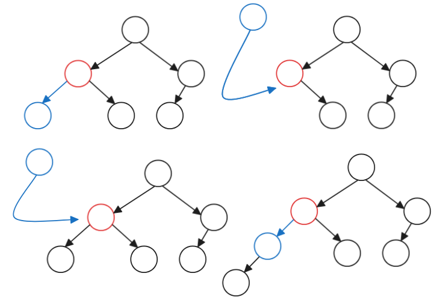
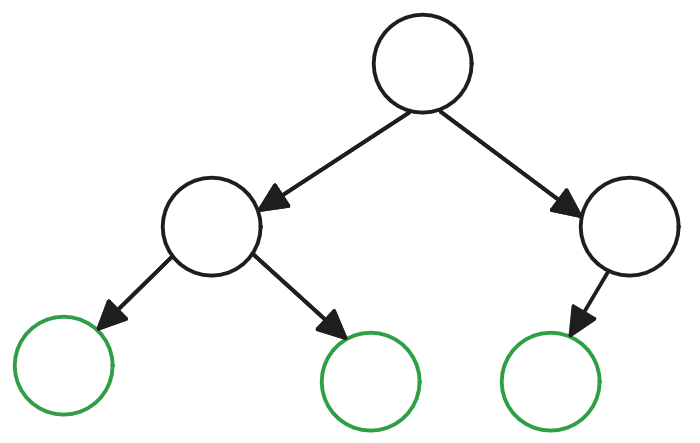
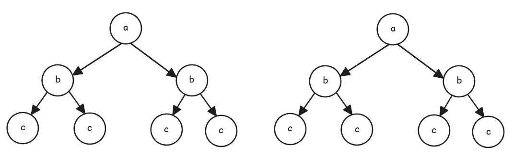
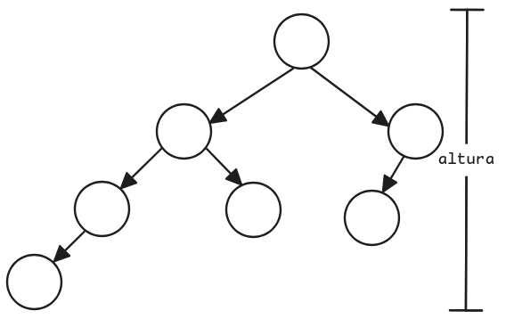
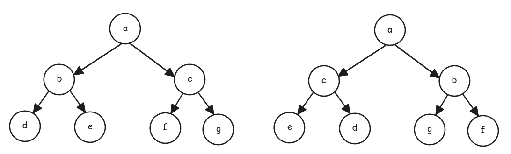
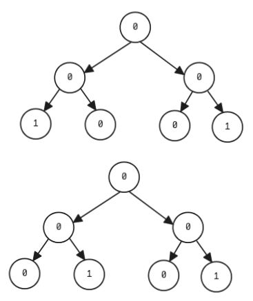
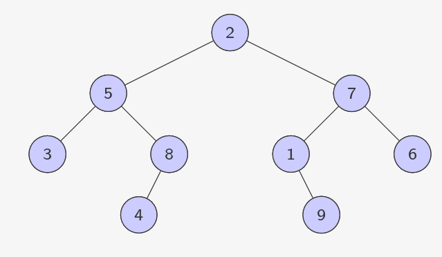

# Árvores Binárias

## Implementação

```python []
class No:
    def __init__(self,d):
        self.dado = d
        self.esq = None
        self.dir = None
         
    def __str__(self):
        return str(self.dado)

class ArvoreBinaria:
    def __init__(self,d):
        self.raiz = No(d)
```

### Métodos - Árvore Binária
I. Inserir novos elementos além da raíz

1. Verificar se o nó já possui um filho à esquerda ou à direita
2. Se não há filho, simplesmente adicionamos um novo nó à árvore
3. Caso contrário, inserimos um novo nó e empurramos o filho existente um nível abaixo na árvore.



```python []
def insereEsq(self, d, no):
         novo = No(d)
         if no.esq == None:
            no.esq = novo
         else:
            novo.esq = no.esq
            no.esq = novo
         return novo
     
     def insereDir(self, d, no):
         novo = No(d)
         if no.dir == None:
            no.dir = novo
         else:
            novo.dir = no.dir
            no.dir = novo
         return novo
```

II. Imprimir a **Árvore Binária**

```python []
    def imprimir(self):
         def imprimirRec(no,nivel,lado):
             if no:
                print(lado,"-"*nivel,no)
                imprimirRec(no.esq,nivel+1,"E")
                imprimirRec(no.dir,nivel+1,"D")   

         imprimirRec(self.raiz,0,"R")
```

III. Contar o número de nós folhas

1. Verifique se o **nó atual existe**.  
Se o nó for **None** (nulo), `retorne 0`, pois **não** há folhas nesse ramo.

2. Verifique se o **nó atual** é uma **folha**.  
Um nó é considerado folha se **não** possui filho **à esquerda** nem **à direita** (isto é, `no.esq is None` e `no.dir is None`).
Se for o caso, `retorne 1`, indicando que **há uma folha**.

3. Se o **nó não for folha**, chame a função **recursivamente** para os **filhos à esquerda** e **à direita**, e **some** os resultados.  
Isso garante que todas as folhas da árvore serão contadas 



```python []
def contafolhas(self):
    def contafolhas_rec(no):
        if no is None:
            return 0
        if no.esq is None and no.dir is None:
            return 1
        return contafolhas_rec(no.esq) + contafolhas_rec(no.dir)
    
    return contafolhas_rec(self.raiz)
```

IV. Verificar se duas **Árvores Binárias** são **iguais**
1. **Se ambas as raízes** forem `None`, isso significa que os dois ramos terminaram ao mesmo tempo (são ambos vazios).  
Nesse caso, **retorne** `True`, pois são **iguais** nesse ponto.

2. **Se apenas uma das raízes** for `None`, significa que uma árvore tem um nó onde a outra não tem.  
**Retorne** `False`, pois as árvores não são estruturalmente iguais.

3. **Se os valores dos nós forem diferentes**, mesmo que ambas as raízes existam, as árvores também não são iguais.  
**Retorne** `False` nesse caso.

4. **Se os valores forem iguais**, compare **recursivamente os filhos à esquerda e à direita** das duas árvores.  
**Retorne** `True` apenas se ambos os lados também forem iguais.




```python []
def eh_igual(self, outra):
        def eh_igual_rec(raiz1, raiz2):
            if raiz1 is None and raiz2 is None:
                return True
            if raiz1 is None or raiz2 is None:
                return False
            if raiz1.dado != raiz2.dado:
                return False
            return (eh_igual_rec(raiz1.esq, raiz2.esq) and 
                    eh_igual_rec(raiz1.dir, raiz2.dir))

        return eh_igual_rec(self.raiz, outra.raiz)
```

V. Calcular a altura de uma **Árvore Binária**

1. **Verifique se o nó atual é** `None` **(nulo)**.  
Isso significa que chegou ao fim de um ramo.  
**Retorne** `0`, pois nós nulos não contribuem para a altura.

2. **Chame recursivamente a função para o filho à esquerda e o filho à direita**.  
Isso permitirá calcular a altura de cada subárvore.

3. **Compare as alturas dos dois lados** usando `max`.  
A altura do nó atual será o **maior valor entre os dois ramos** mais **1** (que representa o próprio nó atual).



```python []
def altura(self):
    def altura_rec(no):
        if no is None:
            return 0

        alturaEsq = altura_rec(no.esq)
        alturaDir = altura_rec(no.dir)

        return max(alturaEsq, alturaDir) + 1

    return altura_rec(self.raiz)
```

VI. **Inverter** uma **Árvore Binária**

1. **Verifique se o nó atual é** `None`.  
Se for, significa que chegou ao fim de um ramo, então não há mais nada a inverter.
**Retorne imediatamente** (caso base da recursão).

2. **Troque os ponteiros dos filhos esquerdo e direito** do nó atual.  
Isso inverte a posição dos filhos no nível atual da árvore.

3. **Chame recursivamente a função para os dois filhos (agora trocados).**  
Isso garante que toda a subárvore abaixo também seja invertida.



```python []
def inverter(self):
    def inverter_rec(no):
        if no is None:
            return
        no.esq, no.dir = no.dir, no.esq
        inverter_rec(no.esq)
        inverter_rec(no.dir)

    return inverter_rec(self.raiz)
```

VII. **Verificar** se a **Árvore Binária** é **simétrica**

1. **Verifique se a árvore está vazia** (`self.raiz is None`).  
Se estiver, considere-a simétrica por definição.
Retorne True.

2. **Crie uma função recursiva para comparar os lados esquerdo e direito da árvore**.

3. **Caso base da recursão**:
    - Se **ambos os nós** forem `None`, os dois ramos estão vazios e são simétricos. **Retorne** `True`.
    - Se **apenas um** dos nós for `None`, os ramos são assimétricos. **Retorne** `False`.

4. **Se ambos os nós existem**:
    - Compare os **valores dos dois nós**. Eles devem ser **iguais**.
    - Verifique **recursivamente se os filhos esquerdos e direitos** estão espelhados:
        - O **esquerdo do primeiro** com o **direito do segundo**
        - O **direito do primeiro** com o **esquerdo do segundo**
    - **Retorne** `True` apenas se tudo isso for verdadeiro.


 
 ```python
 def verificaSimetria(self):
    if self.raiz is None:
        return True

    def verificaSimetria_rec(esq, dir):
        if esq is None and dir is None:
            return True
        if esq is None or dir is None:
            return False
        return (esq.dado == dir.dado and 
                verificaSimetria_rec(esq.esq, dir.dir) and 
                verificaSimetria_rec(esq.dir, dir.esq))

    return verificaSimetria_rec(self.raiz.esq, self.raiz.dir)
 ```

## Travessias

 

### Pré-Ordem
1. Raiz
2. Pré-Ordem na subárvore da esquerda
3. Pré-Ordem na subárvore da direita
> 2-5-3-8-4-7-1-9-6

```python []
def preordem(raiz):
    if raiz:
        print(raiz.dado)
        preordem(raiz.esq)
        preordem(raiz.dir)


```

### Inordem
1. Pós-Ordem na subárvore da esquerda
2. Raiz 
3. Pós-Ordem na subárvore da direita
> 3-5-4-8-2-1-9-7-6

```python []
def inordem(raiz):
    if raiz:
        inordem(raiz.esq)
        print(raiz.dado)
        inordem(raiz.dir)
```

### Pós-Ordem
1. Pós-Ordem na subárvore da esquerda
2. Pós-Ordem na subárvore da direita
3. Raiz
> 3-4-8-5-9-1-6-7-2

```python []
def posordem(raiz):
    if raiz:
        posordem(raiz.esq)
        posordem(raiz.dir)
        print(raiz.dado)
```
